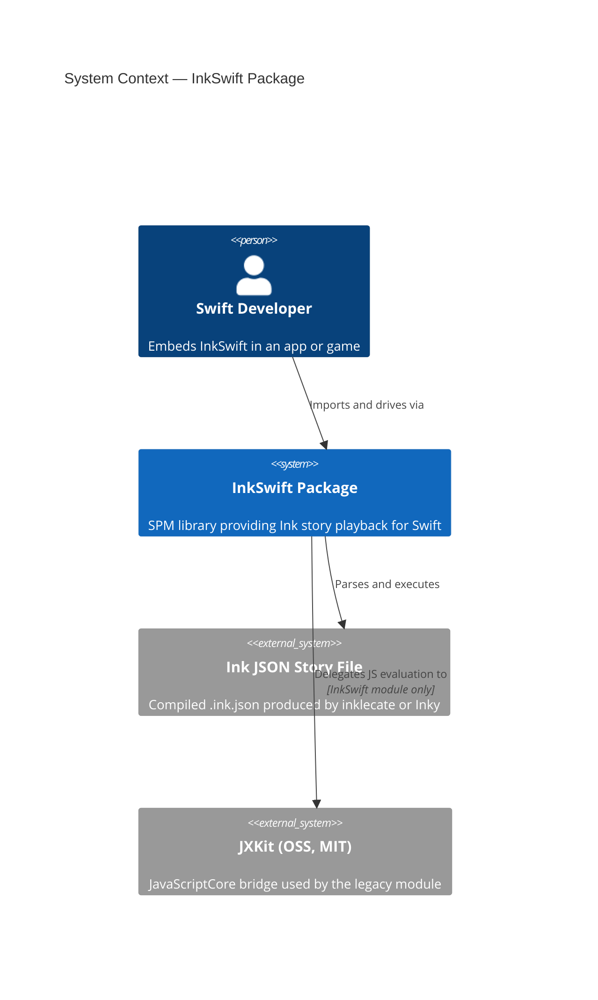
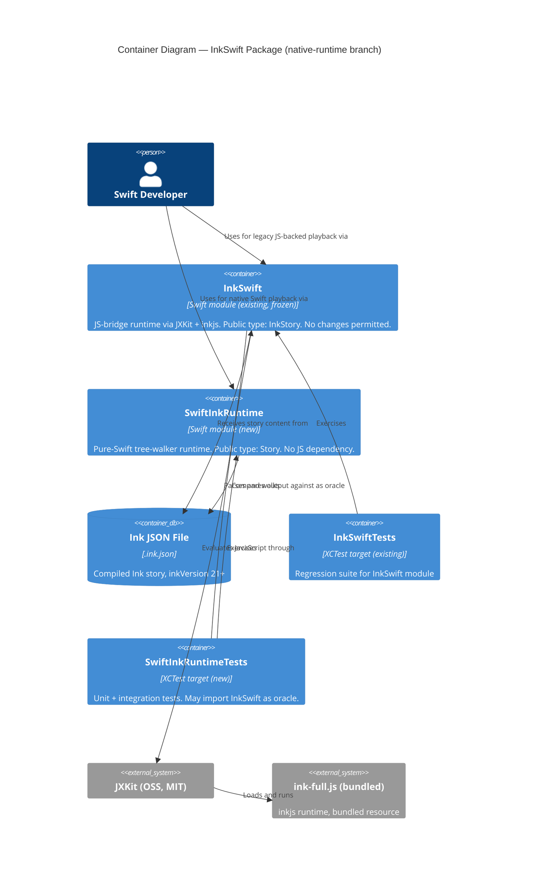

# InkSwift — Architecture Brief

**Document status**: Active — DESIGN wave complete  
**Last updated**: 2026-06-04  
**Branch**: native-runtime  
**Architect**: Morgan (nw-solution-architect)

---

## Application Architecture

### System Context

`InkSwift` is a Swift Package Manager library that lets Swift applications play Ink interactive fiction stories. It currently ships one module (`InkSwift`) that bridges to the inkjs JavaScript runtime via `JXKit`. The `native-runtime` feature adds a second, independent module (`SwiftInkRuntime`) that executes the same Ink JSON format using a pure-Swift tree-walker — no JavaScript engine, no native dependencies beyond Foundation.

The two modules are **parallel, not layered**. Neither imports the other in production code. The test suite of `SwiftInkRuntime` may import `InkSwift` to use `InkStory` as a correctness oracle.

---

### C4 Level 1 — System Context



---

### C4 Level 2 — Container Diagram



---

### C4 Level 3 — SwiftInkRuntime Component Diagram

The `SwiftInkRuntime` module has more than five internal components and warrants a Level 3 diagram.

```mermaid
C4Component
  title Component Diagram — SwiftInkRuntime module

  Container_Boundary(sir, "SwiftInkRuntime") {
    Component(facade, "Story (Facade)", "Facade/ layer", "Public API. Owns no state. Delegates to InkEngine. Exposes: init(json:), continue(), chooseChoice(at:), currentText, canContinue, currentChoices, currentTags, globalTags, currentErrors, saveState(), restoreState(_:).")
    Component(engine, "InkEngine", "Engine/ layer", "final class. Owns var state: StoryState. Drives tree-walker. Enforces execution invariants. Internal only.")
    Component(storystate, "StoryState", "Engine/ layer", "struct, Codable. Holds callstack, visitCounts, currentPointer, variablesState, outputStream, returnStack. Owned by InkEngine.")
    Component(walker, "TreeWalker", "Engine/ layer", "Recursive node visitor. Reads NodeKind, advances pointer, pushes output. Internal only.")
    Component(decoder, "InkDecoder", "Decoder/ layer", "Converts raw JSON (via JSONSerialization) into ContainerNode tree. The only layer permitted to call JSONSerialization. Internal only.")
    Component(nodetypes, "Node Types (ContainerNode, NodeKind)", "Decoder/ layer", "Value types representing parsed Ink AST. NodeKind is internal. ContainerNode is internal. NodeKind includes pushDivertTarget and isVariable-flagged divert for call/return support.")
    Component(tagparser, "TagParser", "Engine/ layer", "Pure function. Parses raw tag strings (\"key: value\" or bare \"key\") into [String: String]. Internal only.")
  }

  Rel(facade, engine, "Drives execution through")
  Rel(facade, storystate, "Reads/writes state snapshots via engine")
  Rel(engine, walker, "Steps story using")
  Rel(engine, storystate, "Reads and mutates")
  Rel(engine, tagparser, "Resolves tag strings with")
  Rel(walker, nodetypes, "Dispatches on NodeKind from")
  Rel(engine, nodetypes, "Holds root ContainerNode from")
  Rel(decoder, nodetypes, "Produces")
  Rel(facade, decoder, "Initialises engine by passing decoded tree from")
```

---

### Module Folder Layout

```
Sources/
  InkSwift/                    ← existing module, frozen, no changes
    InkStory.swift
    ink-full.js

  SwiftInkRuntime/             ← new module
    Decoder/
      InkDecoder.swift         ← JSONSerialization entry point (ONLY file that may call JSONSerialization)
      ContainerNode.swift      ← parsed AST node types
      NodeKind.swift           ← internal enum, never public
    Engine/
      InkEngine.swift          ← final class, internal
      StoryState.swift         ← struct, Codable, internal
      TreeWalker.swift         ← internal
      TagParser.swift          ← internal pure functions
    Facade/
      Story.swift              ← public API

Tests/
  InkSwiftTests/               ← existing test target, unchanged
  SwiftInkRuntimeTests/        ← new test target
    Unit/
    Integration/               ← may import InkSwift as oracle
```

---

### Paradigm and Boundary Rules

**Paradigm**: Object-Oriented with value-type state. Dependency inversion enforced at layer boundaries.

**Three mechanical boundary rules** (enforced by architectural tooling — see ADR-004):

| Rule | Enforcement |
|------|------------|
| **R1 — Dependency direction**: `Facade/` may import `Engine/` and `Decoder/`. `Engine/` may import `Decoder/`. `Decoder/` imports nothing from `Engine/` or `Facade/`. | SourceKit-based import checker in CI; SwiftLint custom rule candidate |
| **R2 — NodeKind stays internal**: `NodeKind` enum carries no `public` modifier. Any `public` on `NodeKind` is a build-time error. | Swift access control; verified by `swift build` |
| **R3 — JSONSerialization boundary**: `JSONSerialization` may only be called from `Decoder/` files. Any call site outside `Decoder/` is a CI violation. | SwiftLint `custom_rules` regex on import/call site, run in CI |

**Earned Trust — adapter probe requirement**: `InkDecoder` is the driven adapter for the filesystem/JSON substrate. The design requires it to expose a `probe()` function exercised at composition startup. The probe must:
1. Attempt to decode a minimal known-good Ink JSON fixture embedded in the test bundle.
2. Verify the root node is a `ContainerNode` with at least one child.
3. Verify that `JSONSerialization` can round-trip the fixture without data loss.

If the probe fails, `Story.init(json:)` throws a structured `StoryError.decoderProbeFailure(reason:)` and the story refuses to start. This is "wire then probe then use."

---

### Technology Stack

| Component | Choice | License | Rationale |
|-----------|--------|---------|-----------|
| Swift | 5.8+ (SPM) | Apache 2.0 | Required by project |
| Foundation | Bundled | Apple APSL | Provides `JSONSerialization`, `Codable`. No additional dependency. |
| JXKit | 3.x (existing) | MIT | Used only by frozen `InkSwift` module |
| SwiftLint | 0.55+ (dev tool) | MIT | Enforces architectural boundary rules R1/R3 |
| XCTest | Bundled | Apple | Test framework; no additional dependency |

No new runtime dependencies are introduced by `SwiftInkRuntime`. JXKit is not a dependency of the new module.

---

### Integration Pattern — InkSwift and SwiftInkRuntime

The two modules are **parallel tracks** within the same SPM package. They share:
- The same `.ink.json` file format (read-only input — the format is owned by the Ink C# compiler)
- The same test fixture files (`test.ink.json`, `TheIntercept.ink`) via the `SwiftInkRuntimeTests` test target resources

They do NOT share:
- Any Swift types (no cross-module imports in production code)
- State serialization format (`InkSwift.SaveState` stores raw JS-engine JSON; `SwiftInkRuntime.StoryState` uses a new Codable format)
- Public API surface (different type names, different method signatures)

The oracle pattern in tests is a one-directional import: `SwiftInkRuntimeTests` imports `InkSwift` to drive `InkStory` and compare output. `InkSwift` never imports `SwiftInkRuntime`.

---

### Quality Attribute Strategies

**Maintainability**: Enforced layer boundaries prevent accretion of cross-layer dependencies. Every node type is an internal value type, keeping the public surface minimal.

**Testability**: `InkEngine` and `TreeWalker` are internal but accessible to the test target via `@testable import`. The `InkDecoder` is independently testable from the engine — it produces a pure data structure with no side effects.

**Correctness**: The `InkStory` (JS bridge) serves as a continuously-exercised oracle. Integration tests drive both implementations against the same `.ink.json` fixture and assert output equality line by line.

**Debuggability**: Tree-walker model (Decision 3) allows a test to stop the walker at any node and inspect `StoryState` directly. No opaque stack-machine bytecode to decode during debugging.

**Portability**: No JavaScript engine dependency in `SwiftInkRuntime`. Compiles on any platform where Swift + Foundation are available (Linux, WASM targets in future).

**Reliability — Earned Trust**: The `InkDecoder.probe()` requirement means a malformed JSON runtime environment (corrupted bundle, wrong file format version) is caught at story initialisation time, not mid-playback.

---

### Ink Feature Coverage

This section tracks which Ink language features the `SwiftInkRuntime` engine supports, using **The Intercept** (inkle, MIT) as the upper-bound reference story. The Intercept exercises Parts 1–4 of the official Ink specification (28 knots, 47 stitches, 21 variables, 156+ choices, 8 tunnels) without using sequences, lists, threads, or RANDOM — making it a well-bounded, achievable ceiling.

Feature tiers follow inkle's own documentation structure:
- **CORE** — required by every non-trivial story (Parts 1–2)
- **STANDARD** — needed for real games with variables and logic (Part 3)
- **ADVANCED** — complex flow control used in The Intercept (Part 4)
- **BEYOND** — not used in The Intercept; lowest priority

#### Feature Coverage Matrix

| # | Feature | Tier | In The Intercept | Engine Status | Notes |
|---|---------|------|-----------------|---------------|-------|
| 1 | Text output / newlines | CORE | Yes | **WORKS** | |
| 2 | Knots (`=== name`) | CORE | Yes (28) | **WORKS** | |
| 3 | Stitches (`= name`) | CORE | Yes (47) | **WORKS** | |
| 4 | Diverts (`->`) | CORE | Yes (110+) | **WORKS** (absolute paths) | Relative paths broken — see #5 |
| 5 | Relative paths (`.^.x`) | CORE | Yes (all within-knot) | **BROKEN** | `resolveNamedPath` has no `^` support; iklecate always emits relative paths in knots |
| 6 | Plain choices (`* text`) | CORE | Yes | **WORKS** | |
| 7 | Bracketed choices (`* [text]`) | CORE | Yes (majority of 156+) | **BROKEN** | `flg=20`: choice text on `evalStack` via `str`/`/str`; engine reads `namedContent["s"]` only |
| 8 | Sticky choices (`+ text`) | CORE | Yes | **UNKNOWN** | `flg` field parsed but not dispatched |
| 9 | Once-only suppression (`flg=8`) | CORE | Yes | **UNKNOWN** | Flag ignored; choice always shown |
| 10 | Invisible defaults (`flg=4`) | CORE | Yes | **UNKNOWN** | Flag ignored; gather shown as choice |
| 11 | Conditional choices (`* {cond}`) | CORE | Yes | **PARTIAL** | `isConditional` parsed; never gated at runtime |
| 12 | Gathers (`-`) | CORE | Yes | **PARTIAL** | Anchors exist; nested depth untested |
| 13 | Labeled gathers / options `(label)` | CORE | Yes | **PARTIAL** | Anchor resolution implemented; not fully tested |
| 14 | Read counts (knot visit counters) | CORE | Yes | **MISSING** | `CNT?` native function deferred; `visitCounts` map exists |
| 15 | Glue (`<>`) | CORE | Likely | **UNKNOWN** | No test coverage |
| 16 | VAR global variables | STANDARD | Yes (21) | **WORKS** | |
| 17 | CONST declarations | STANDARD | Yes (6) | **UNKNOWN** | Parsed? No test |
| 18 | Temp variables (`~ temp`) | STANDARD | Yes | **WORKS** | |
| 19 | Variable assignment (`~ x =`) | STANDARD | Yes | **WORKS** | |
| 20 | Variable read in output (`{x}`) | STANDARD | Yes | **WORKS** | |
| 21 | Arithmetic / logic operators | STANDARD | Yes | **WORKS** | `+`,`-`,`*`,`/`,`%`,`==`,`!=`,`>`,`<`,`&&`,`||`,`!` |
| 22 | Inline conditionals (`{c: a\|b}`) | STANDARD | Yes (95+) | **UNKNOWN** | No test at all |
| 23 | Block conditionals (if / else if) | STANDARD | Yes | **UNKNOWN** | No test |
| 24 | Switch-style conditionals | STANDARD | Yes (CONST dispatch) | **UNKNOWN** | No test |
| 25 | Variable text: sequences (`{a\|b\|c}`) | STANDARD | No | **UNKNOWN** | `"seq"` command listed; no handler |
| 26 | Variable text: cycles (`{&}`) | STANDARD | No | **UNKNOWN** | No handler |
| 27 | Variable text: once-only (`{!}`) | STANDARD | No | **UNKNOWN** | No handler |
| 28 | Variable text: shuffle (`{~}`) | STANDARD | No | **UNKNOWN** | No handler |
| 29 | Functions (`=== f(params) ===`) | STANDARD | Yes (2) | **UNKNOWN** | No test |
| 30 | Inline function calls `{f()}` | STANDARD | Yes | **UNKNOWN** | No test |
| 31 | String interpolation | STANDARD | Yes | **WORKS** | `str`/`/str` handler correct in TreeWalker |
| 32 | Tags (`#tag`) | STANDARD | No | **WORKS** | Implemented ahead of need |
| 33 | Save / restore | STANDARD | — | **WORKS** | `StoryState` is `Codable` |
| 34 | Tunnels (`-> knot ->`) | ADVANCED | Yes (8) | **MISSING** | ADR-004 defers; needs nested call frames |
| 35 | Reference parameters (`ref x`) | ADVANCED | Yes | **MISSING** | Not modelled |
| 36 | Threads | BEYOND | No | **MISSING** | Lowest priority |
| 37 | LIST declarations | BEYOND | No | **MISSING** | `listDefs` placeholder only |
| 38 | RANDOM / SEED_RANDOM | BEYOND | No | **MISSING** | Not started |
| 39 | External functions | BEYOND | No | **MISSING** | `exArgs` deferred |

#### Implementation Roadmap by Tier

**Tier 1 (immediate — unblocks any real story):**
Rows 5, 7 — relative path resolution + bracketed choice text. Root cause: engine choice-text shortcut (`namedContent["s"]`) must be replaced with `evalStack` consumption; `resolveNamedPath` must gain `^` parent-traversal support. See RCA in `docs/feature/fix-choice-text-path-resolution/design/wave-decisions.md`.

**Tier 2 (core completeness — before a representative story runs):**
Rows 8–11, 14 — choice flag bitmask (sticky, once-only, invisible defaults), conditional choice gating, read counts.

**Tier 3 (The Intercept ceiling):**
Rows 22–24, 29–30 — conditional text, functions.
Rows 34–35 — tunnels, reference parameters.

---

### ADR Index

| ADR | Title | Status |
|-----|-------|--------|
| [ADR-001](./adr-001-execution-model.md) | Execution Model: Tree-Walker vs Stack Machine | Accepted |
| [ADR-002](./adr-002-api-contract.md) | API Contract: Clean Redesign, Story Type Name, InkStory Frozen | Accepted |
| [ADR-003](./adr-003-state-serialization.md) | State Serialization: Codable Format, No inkjs Compatibility | Accepted |
| [ADR-004](./adr-004-callreturn-mechanism.md) | Call/Return Mechanism: Return Address Stack in StoryState | Accepted |

---

### External Integrations

None. `SwiftInkRuntime` has no external API calls, no network dependencies, no third-party services. The only external boundary is the `.ink.json` file format — a static, file-system artifact. Contract testing is not applicable.

---

### Architectural Enforcement Tooling

Recommended tool: **SwiftLint** (MIT, `realm/SwiftLint`, 18k+ stars, active maintenance).

Configuration:
- `custom_rules`: regex rules to detect `JSONSerialization` usage outside `Decoder/` path.
- `no_extension_access_modifier` and access-control rules to catch accidental `public` on internal types.

Supplementary: **Swift compiler access control** enforces `internal`/`public` at compile time — R2 (NodeKind stays internal) is enforced by the language itself.

CI gate: SwiftLint runs in the `lint` CI stage before `build`. A single violation blocks the build.
