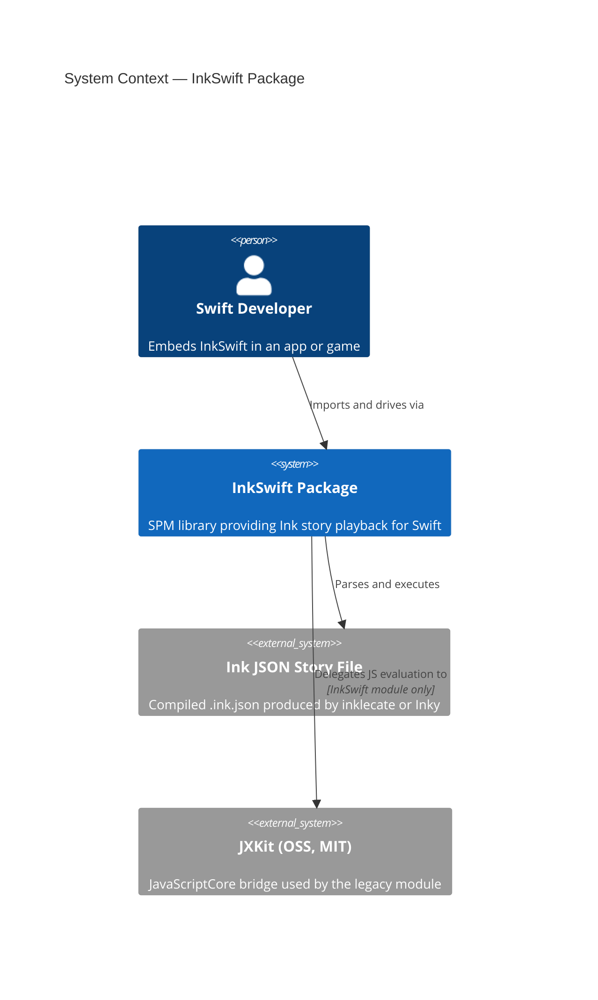
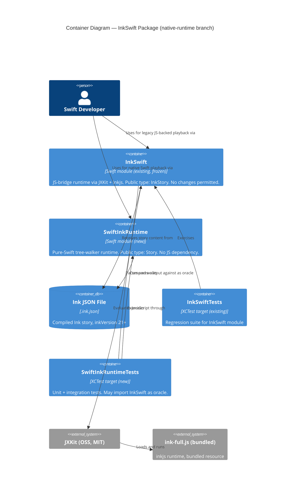
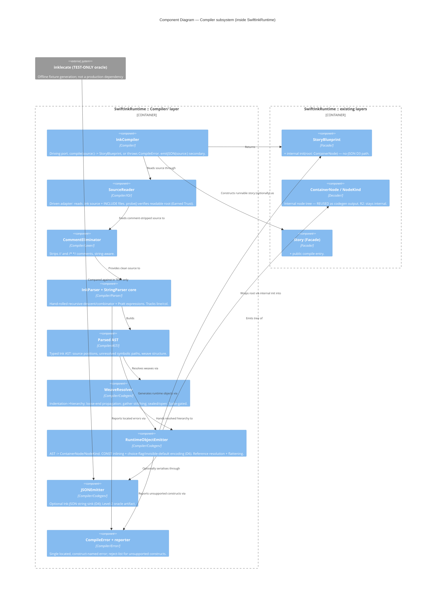
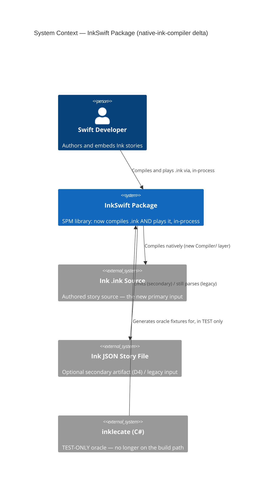
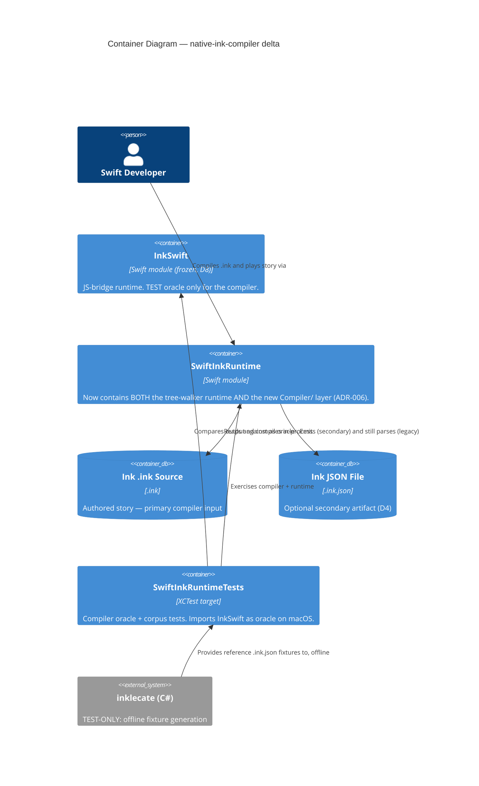

# InkSwift — Architecture Brief

**Document status**: Active — DESIGN wave complete  
**Last updated**: 2026-06-04  
**Branch**: native-runtime  
**Architect**: Morgan (nw-solution-architect)

---

## Application Architecture

### System Context

`InkSwift` is a Swift Package Manager library that lets Swift applications play Ink interactive fiction stories. It currently ships one module (`InkSwift`) that bridges to the inkjs JavaScript runtime via `JXKit`. The `native-runtime` feature adds a second, independent module (`SwiftInkRuntime`) that executes the same Ink JSON format using a pure-Swift tree-walker — no JavaScript engine, no native dependencies beyond Foundation.

The two modules are **parallel, not layered**. Neither imports the other in production code. The test suite of `SwiftInkRuntime` may import `InkSwift` to use `InkStory` as a correctness oracle.

---

### C4 Level 1 — System Context



---

### C4 Level 2 — Container Diagram



---

### C4 Level 3 — SwiftInkRuntime Component Diagram

The `SwiftInkRuntime` module has more than five internal components and warrants a Level 3 diagram.

```mermaid
C4Component
  title Component Diagram — SwiftInkRuntime module

  Container_Boundary(sir, "SwiftInkRuntime") {
    Component(facade, "Story (Facade)", "Facade/ layer", "Public API. Owns no state. Delegates to InkEngine. Exposes: init(json:), continue(), chooseChoice(at:), currentText, canContinue, currentChoices, currentTags, globalTags, currentErrors, saveState(), restoreState(_:).")
    Component(engine, "InkEngine", "Engine/ layer", "final class. Owns var state: StoryState. Drives tree-walker. Enforces execution invariants. Internal only.")
    Component(storystate, "StoryState", "Engine/ layer", "struct, Codable. Holds callstack, visitCounts, currentPointer, variablesState, outputStream, returnStack. Owned by InkEngine.")
    Component(walker, "TreeWalker", "Engine/ layer", "Recursive node visitor. Reads NodeKind, advances pointer, pushes output. Internal only.")
    Component(decoder, "InkDecoder", "Decoder/ layer", "Converts raw JSON (via JSONSerialization) into ContainerNode tree. The only layer permitted to call JSONSerialization. Internal only.")
    Component(nodetypes, "Node Types (ContainerNode, NodeKind)", "Decoder/ layer", "Value types representing parsed Ink AST. NodeKind is internal. ContainerNode is internal. NodeKind includes pushDivertTarget and isVariable-flagged divert for call/return support.")
    Component(tagparser, "TagParser", "Engine/ layer", "Pure function. Parses raw tag strings (\"key: value\" or bare \"key\") into [String: String]. Internal only.")
  }

  Rel(facade, engine, "Drives execution through")
  Rel(facade, storystate, "Reads/writes state snapshots via engine")
  Rel(engine, walker, "Steps story using")
  Rel(engine, storystate, "Reads and mutates")
  Rel(engine, tagparser, "Resolves tag strings with")
  Rel(walker, nodetypes, "Dispatches on NodeKind from")
  Rel(engine, nodetypes, "Holds root ContainerNode from")
  Rel(decoder, nodetypes, "Produces")
  Rel(facade, decoder, "Initialises engine by passing decoded tree from")
```

---

### Module Folder Layout

```
Sources/
  InkSwift/                    ← existing module, frozen, no changes
    InkStory.swift
    ink-full.js

  SwiftInkRuntime/             ← new module
    Decoder/
      InkDecoder.swift         ← JSONSerialization entry point (ONLY file that may call JSONSerialization)
      ContainerNode.swift      ← parsed AST node types
      NodeKind.swift           ← internal enum, never public
    Engine/
      InkEngine.swift          ← final class, internal
      StoryState.swift         ← struct, Codable, internal
      TreeWalker.swift         ← internal
      TagParser.swift          ← internal pure functions
    Facade/
      Story.swift              ← public API

Tests/
  InkSwiftTests/               ← existing test target, unchanged
  SwiftInkRuntimeTests/        ← new test target
    Unit/
    Integration/               ← may import InkSwift as oracle
```

---

### Paradigm and Boundary Rules

**Paradigm**: Object-Oriented with value-type state. Dependency inversion enforced at layer boundaries.

**Three mechanical boundary rules** (enforced by architectural tooling — see ADR-004):

| Rule | Enforcement |
|------|------------|
| **R1 — Dependency direction**: `Facade/` may import `Engine/` and `Decoder/`. `Engine/` may import `Decoder/`. `Decoder/` imports nothing from `Engine/` or `Facade/`. | SourceKit-based import checker in CI; SwiftLint custom rule candidate |
| **R2 — NodeKind stays internal**: `NodeKind` enum carries no `public` modifier. Any `public` on `NodeKind` is a build-time error. | Swift access control; verified by `swift build` |
| **R3 — JSONSerialization boundary**: `JSONSerialization` may only be called from `Decoder/` files. Any call site outside `Decoder/` is a CI violation. | SwiftLint `custom_rules` regex on import/call site, run in CI |

**Earned Trust — adapter probe requirement**: `InkDecoder` is the driven adapter for the filesystem/JSON substrate. The design requires it to expose a `probe()` function exercised at composition startup. The probe must:
1. Attempt to decode a minimal known-good Ink JSON fixture embedded in the test bundle.
2. Verify the root node is a `ContainerNode` with at least one child.
3. Verify that `JSONSerialization` can round-trip the fixture without data loss.

If the probe fails, `Story.init(json:)` throws a structured `StoryError.decoderProbeFailure(reason:)` and the story refuses to start. This is "wire then probe then use."

---

### Technology Stack

| Component | Choice | License | Rationale |
|-----------|--------|---------|-----------|
| Swift | 5.8+ (SPM) | Apache 2.0 | Required by project |
| Foundation | Bundled | Apple APSL | Provides `JSONSerialization`, `Codable`. No additional dependency. |
| JXKit | 3.x (existing) | MIT | Used only by frozen `InkSwift` module |
| SwiftLint | 0.55+ (dev tool) | MIT | Enforces architectural boundary rules R1/R3 |
| XCTest | Bundled | Apple | Test framework; no additional dependency |

No new runtime dependencies are introduced by `SwiftInkRuntime`. JXKit is not a dependency of the new module.

---

### Integration Pattern — InkSwift and SwiftInkRuntime

The two modules are **parallel tracks** within the same SPM package. They share:
- The same `.ink.json` file format (read-only input — the format is owned by the Ink C# compiler)
- The same test fixture files (`test.ink.json`, `TheIntercept.ink`) via the `SwiftInkRuntimeTests` test target resources

They do NOT share:
- Any Swift types (no cross-module imports in production code)
- State serialization format (`InkSwift.SaveState` stores raw JS-engine JSON; `SwiftInkRuntime.StoryState` uses a new Codable format)
- Public API surface (different type names, different method signatures)

The oracle pattern in tests is a one-directional import: `SwiftInkRuntimeTests` imports `InkSwift` to drive `InkStory` and compare output. `InkSwift` never imports `SwiftInkRuntime`.

---

### Quality Attribute Strategies

**Maintainability**: Enforced layer boundaries prevent accretion of cross-layer dependencies. Every node type is an internal value type, keeping the public surface minimal.

**Testability**: `InkEngine` and `TreeWalker` are internal but accessible to the test target via `@testable import`. The `InkDecoder` is independently testable from the engine — it produces a pure data structure with no side effects.

**Correctness**: The `InkStory` (JS bridge) serves as a continuously-exercised oracle. Integration tests drive both implementations against the same `.ink.json` fixture and assert output equality line by line.

**Debuggability**: Tree-walker model (Decision 3) allows a test to stop the walker at any node and inspect `StoryState` directly. No opaque stack-machine bytecode to decode during debugging.

**Portability**: No JavaScript engine dependency in `SwiftInkRuntime`. Compiles on any platform where Swift + Foundation are available (Linux, WASM targets in future).

**Reliability — Earned Trust**: The `InkDecoder.probe()` requirement means a malformed JSON runtime environment (corrupted bundle, wrong file format version) is caught at story initialisation time, not mid-playback.

---

### Ink Feature Coverage

This section tracks which Ink language features the `SwiftInkRuntime` engine supports, using **The Intercept** (inkle, MIT) as the upper-bound reference story. The Intercept exercises Parts 1–4 of the official Ink specification (28 knots, 47 stitches, 21 variables, 156+ choices, 8 tunnels) without using sequences, lists, threads, or RANDOM — making it a well-bounded, achievable ceiling.

Feature tiers follow inkle's own documentation structure:
- **CORE** — required by every non-trivial story (Parts 1–2)
- **STANDARD** — needed for real games with variables and logic (Part 3)
- **ADVANCED** — complex flow control used in The Intercept (Part 4)
- **BEYOND** — not used in The Intercept; lowest priority

#### Feature Coverage Matrix

| # | Feature | Tier | In The Intercept | Engine Status | Notes |
|---|---------|------|-----------------|---------------|-------|
| 1 | Text output / newlines | CORE | Yes | **WORKS** | |
| 2 | Knots (`=== name`) | CORE | Yes (28) | **WORKS** | |
| 3 | Stitches (`= name`) | CORE | Yes (47) | **WORKS** | |
| 4 | Diverts (`->`) | CORE | Yes (110+) | **WORKS** | Absolute, relative pure-ancestor (`.^.^`), and anchor (`$rN`) diverts all resolve. `text -> divert` flushes the line before the stack collapses. |
| 5 | Relative paths (`.^.x`) | CORE | Yes (all within-knot) | **WORKS** | Caret parent-traversal + named lookup per stack frame, captured as `pathFromRoot` so it round-trips through save/restore |
| 6 | Plain choices (`* text`) | CORE | Yes | **WORKS** | |
| 7 | Bracketed choices (`* [text]`) | CORE | Yes (majority of 156+) | **WORKS** | `flg=20` choice text consumed from `evalStack`; `flg=18`/`22` use `namedContent["s"]` fallback |
| 8 | Sticky choices (`+ text`) | CORE | Yes | **IMPLEMENTED** | Sticky (`+`) choices remain after being picked; differentiated from once-only by `flags & 0x10 == 0` (tier2-choice-mechanics) |
| 9 | Once-only suppression (`flg=0x10`) | CORE | Yes | **IMPLEMENTED** | Picked once-only choices suppressed via `chosenChoiceTargets: Set<String>` on StoryState; survives save/restore (tier2-choice-mechanics) |
| 10 | Invisible defaults (`flags & 0x17 == 0`) | CORE | Yes | **IMPLEMENTED** | Auto-divert applied when `currentChoices` is empty and invisible default recorded; inklecate v0.9 `flg: 0` detection (tier2-choice-mechanics) |
| 11 | Conditional choices (`* {cond}`) | CORE | Yes | **IMPLEMENTED** | `evalStack` popped when `flags & 0x01`; false result skips choice; stack always balanced (tier2-choice-mechanics) |
| 12 | Gathers (`-`) | CORE | Yes | **IMPLEMENTED** | Multi-level nested gathers exercised by The Intercept 100-line non-trivial playthrough (`Milestone5b`) — covers depth-1 / depth-2 / depth-3 gather chains |
| 13 | Labeled gathers / options `(label)` | CORE | Yes | **IMPLEMENTED** | Labeled gathers (`pushes_cup`, `monastic`, `say_nothing`, `disagree`, …) exercised by The Intercept non-trivial playthrough; relative diverts to labels resolved via path-component caret math (`InkEngine.parseRelativePath`) |
| 14 | Read counts (knot visit counters) | CORE | Yes | **IMPLEMENTED** | `NodeKind.readCount(String)`, `InkDecoder` CNT? handler, `TreeWalker` dispatch, and `#f` bit `0x1` container-entry increment (tier2-choice-mechanics) |
| 15 | Glue (`<>`) | CORE | Yes (heavy) | **IMPLEMENTED** | `<>` removes trailing `\n` and suppresses next `\n` (`TreeWalker.handleControlCommand`); cross-divert glue handled by `evalBlockDepth` flush deferral; baseline `Bug_GlueAfterChoiceTests`; non-trivial Intercept playthrough validates glue across function-call diverts |
| 16 | VAR global variables | STANDARD | Yes (21) | **WORKS** | |
| 17 | CONST declarations | STANDARD | Yes (6: `NONE`, `STRAIGHT`, `CHESS`, `CROSSWORD`, `SHOE`, `BUCKET`) | **IMPLEMENTED** | Inklecate inlines CONSTs at compile time as integer literals, so no engine support is required. End-to-end correctness validated by The Intercept non-trivial playthrough (the `hooperClueType` / `smashingWindowItem` comparisons resolve identically to the JS-bridge oracle) |
| 18 | Temp variables (`~ temp`) | STANDARD | Yes | **WORKS** | |
| 19 | Variable assignment (`~ x =`) | STANDARD | Yes | **WORKS** | |
| 20 | Variable read in output (`{x}`) | STANDARD | Yes | **WORKS** | |
| 21 | Arithmetic / logic operators | STANDARD | Yes | **WORKS** | `+`,`-`,`*`,`/`,`%`,`==`,`!=`,`>`,`<`,`&&`,`||`,`!` |
| 22 | Inline conditionals (`{c: a\|b}`) | STANDARD | Yes (95+) | **IMPLEMENTED** | Slice C1 (`slice-c1-inline-conditionals`) + The Intercept non-trivial playthrough; reuses existing `isConditional` divert pathway, no new NodeKind cases (tier3-conditionals-and-tunnels D1) |
| 23 | Block conditionals (if / else if) | STANDARD | Yes | **IMPLEMENTED** | Slice C2 (`slice-c2-block-conditionals`) + The Intercept; shares C1's `applyConditionalBranch` mechanism (tier3 D2). The 4-bug cascade behind the Intercept GREEN included a flush-defer fix for the multi-line `{cond: a - else: b}` + cluster pattern (`Bug_DeferFlushDuringChoiceClusterTests`) |
| 24 | Switch-style conditionals | STANDARD | Yes (CONST dispatch) | **IMPLEMENTED** | Slice C2 + The Intercept; switch dispatch uses the existing `==` native function plus per-case conditional diverts (tier3 D2) |
| 25 | Variable text: sequences (`{a\|b\|c}`) | STANDARD | No | **UNKNOWN** | `"seq"` command listed; no handler |
| 26 | Variable text: cycles (`{&}`) | STANDARD | No | **UNKNOWN** | No handler |
| 27 | Variable text: once-only (`{!}`) | STANDARD | No | **UNKNOWN** | No handler |
| 28 | Variable text: shuffle (`{~}`) | STANDARD | No | **UNKNOWN** | No handler |
| 29 | Functions (`=== f(params) ===`) | STANDARD | Yes (2: `raise`, `lower`) | **IMPLEMENTED** | Slice C3 (`slice-c3-functions`) + The Intercept (raise/lower exercised through every Disagree/Lie/Evade body); `f():`-prefixed divert with `fnret:`-prefixed return address in `returnStack`; per-frame temp scope via `StoryState.callFrameVariables` (tier3 D3 + fix `36e3052`) |
| 30 | Inline function calls `{f()}` | STANDARD | Yes | **IMPLEMENTED** | Slice C3 (`{double(5)}`, `{setSideEffect()}`) + The Intercept; `out` / `pop` control commands handle return-value emission vs. discard (`distill/upstream-issues.md` Issues 1 + 2) |
| 31 | String interpolation | STANDARD | Yes | **WORKS** | `str`/`/str` handler correct in TreeWalker |
| 32 | Tags (`#tag`) | STANDARD | No | **WORKS** | Implemented ahead of need |
| 33 | Save / restore | STANDARD | — | **WORKS** | `StoryState` is `Codable`; survives `chooseChoice` round-trip via `pathFromRoot` frames + `ChoiceData.continuationFrames` |
| 34 | Tunnels (`-> knot ->`) | ADVANCED | Yes (8) | **IMPLEMENTED** | Slices T1 (single) + T2 (nested) + The Intercept (all 8 tunnels exercised). `NodeKind.tunnelDivert(target:)` plus pre-dispatch `->t->` / `->->` intercepts in `InkEngine.stepToNextLine`; `returnStack` from ADR-004 reused with no new StoryState field (tier3 D4) |
| 35 | Reference parameters (`ref x`) | ADVANCED | Yes (`raise(ref x)`, `lower(ref x)`) | **IMPLEMENTED** | Slice T3 + The Intercept. `NodeKind.variablePointer(name:, contextIndex:)`; `ci == -1` = global scope (NOT `ci == 0` as DESIGN assumed — see `distill/upstream-issues.md` Issue 3). Function-local temp leak between consecutive ref-param calls fixed by `callFrameVariables` per-frame scope (commit `36e3052`, lands deferred T3 DESIGN D5 Option A) |
| 36 | Threads | BEYOND | No | **MISSING** | Lowest priority |
| 37 | LIST declarations | BEYOND | No | **MISSING** | `listDefs` placeholder only |
| 38 | RANDOM / SEED_RANDOM | BEYOND | No | **MISSING** | Not started |
| 39 | External functions | BEYOND | No | **MISSING** | `exArgs` deferred |

#### Implementation Roadmap by Tier

**Tier 1 (immediate — unblocks any real story): COMPLETE**
Rows 5, 7 are `WORKS`. Beyond the originally-scoped fix, follow-up work driven by an InkTest playthrough also delivered:
- One-level callstack for chosen continuations (`isChoiceContinuationRoot`) so picking an outer choice no longer falls through into the parent's remaining choice generators.
- Pre-divert output flush so `text -> divert` on the same Ink source line emits the text before the stack collapses.
- Save/restore round-trip across `chooseChoice` via `pathFromRoot`-based stack frames and `ChoiceData.continuationFrames`.

See RCA in `docs/feature/fix-choice-text-path-resolution/design/wave-decisions.md`.

**Tier 2 (core completeness): COMPLETE**
Rows 8–11, 14 — choice flag bitmask (sticky/once-only differentiation), once-only suppression, invisible default auto-divert, conditional choice gating, read counts. All implemented in `tier2-choice-mechanics`. 95 tests passing. See `docs/evolution/2026-06-05-tier2-choice-mechanics.md`.

**Tier 3 (The Intercept ceiling): COMPLETE**
Rows 22–24, 29–30 — conditional text, functions.
Rows 34–35 — tunnels, reference parameters.
Implemented in `tier3-conditionals-and-tunnels` (commits up through `977ea20`). Initial delivery passed all six slice suites and the always-pick-0 oracle playthrough; the DISTILL non-trivial playthrough test was committed RED on purpose as a deterministic bug-trap. A follow-on bugfix cascade (commits `912c04a` → `7dccb97` → `36e3052` → `4ab1606`) then resolved four engine bugs that the always-pick-0 path never exercised:

1. **Caret math depth** — `parseRelativePath` was counting stack-frame depth instead of compiled-path-component depth (the canonical C# semantic per `ink-engine-runtime/Path.cs:220-223` and `Object.cs:106-123`). Fixed by `topFrame.pathFromRoot.dropLast(caretCount - 1)`.
2. **Eval-block flush** — `stepToNextLine` was flushing pending lines at the start of `ev`/`/ev` blocks before downstream function-call diverts + destination glue could remove the trailing `\n`. Fixed by an `evalBlockDepth` counter; also made `flushRemainingOutput` line-aware and `canContinue` allow draining buffered lines after `isEnded`.
3. **Per-frame temp scope** — `TreeWalker.handleVariableAssignment` was writing both `VAR=` and `temp=` into a single `variablesState` dict; consecutive ref-param calls corrupted each other through stale pointer leftovers. Fixed by adding `callFrameVariables: [[String: InkValue]]` to `StoryState`, pushed by `applyFunctionCall` and popped by `applyFunctionReturn` (this lands the deferred T3 DESIGN D5 Option A).
4. **Cluster flush deferral** — after the first choicePoint was collected, a flush at the next `/ev` boundary returned early; the caller saw `canContinue == false` and never visited the remaining choicePoints. Fixed by deferring flush while `currentChoices` is non-empty, matching the C# `Continue()` loop which separates pointer-based `canContinue` from choice availability.

Final state: 154 of 154 tests in 26 suites GREEN. The 100-line non-trivial Intercept playthrough matches the JS-bridge oracle line-for-line. Three baseline regression suites (`Bug_GlueAfterChoiceTests`, `Bug_DeferFlushDuringChoiceClusterTests`, `TheInterceptNonTrivialPlaythroughTests`) guard against regressions. See `docs/feature/tier3-conditionals-and-tunnels/distill/upstream-issues.md` and `wave-decisions.md` for the full chain.

---

### Tier 2 — Choice Mechanics (tier2-choice-mechanics)

This subsection records the concrete architectural decisions for the `tier2-choice-mechanics` feature. It covers rows 8–11 and 14 of the Feature Coverage Matrix (sticky/once-only differentiation, conditional gating, invisible defaults, read counts).

No new source files are introduced. The changes are localised to three existing files: `InkEngine.swift`, `StoryState.swift`, and `TreeWalker.swift`.

#### Reuse Analysis

| Existing Component | File | Overlap | Decision | Justification |
|---|---|---|---|---|
| `InkEngine` | `Engine/InkEngine.swift` | Choice-collection loop; `chooseChoice(at:)` | Extend | The collection loop and choice dispatch already exist; once-only, conditional, and invisible-default logic is purely additive gating within those loops |
| `StoryState` | `Engine/StoryState.swift` | Codable state struct | Extend | Needs one new field (`chosenChoiceTargets`) and one field on `ChoiceData` (`flags`); both added as `decodeIfPresent` with safe defaults for backward compatibility |
| `TreeWalker` | `Engine/TreeWalker.swift` | `dispatch` switch | Extend | `.readCount(key)` is one new `case` in the existing dispatch; `#f` container flag check triggers `visitCounts` increment |
| `NodeKind` | `Decoder/NodeKind.swift` | Node kind enum | Extend | New case `.readCount(String)` for `{"CNT?": key}` dict nodes |
| `InkDecoder` | `Decoder/InkDecoder.swift` | `classifyDict` | Extend | Match `{"CNT?": key}` → `.readCount(key)` before the unknown-fallback path |

#### Flag Bit Reference

Authoritative source: `docs/ink_JSON_runtime_format.md` § ChoicePoint, and inklecate v0.9 compiled output.

| Bit | Value | Name | Meaning |
|-----|-------|------|---------|
| 0 | 1 | `hasCondition` | Choice has a preceding `ev … /ev` condition block; result is on `evalStack` |
| 1 | 2 | `hasStartContent` | Leading text before `[` is present on the eval stack |
| 2 | 4 | `hasChoiceOnlyContent` | Text inside `[…]` is present on the eval stack |
| 3 | 8 | `isInvisibleDefault` | Auto-divert fallback; excluded from `currentChoices` (note: inklecate v0.9 compiles `+ []` to `flg: 0`, not `flg: 8` — see D4) |
| 4 | 16 | `onceOnly` | `*` choice — suppressed after being picked once |

A `*` (once-only) choice has bit 4 **set** (`flags & 0x10 != 0`).  
A `+` (sticky) choice has bit 4 **unset** (`flags & 0x10 == 0`).

#### D1 — Once-only suppression (S1)

In the choice-collection loop inside `InkEngine.stepToNextLine`, before appending a choice to `state.currentChoices`, the engine checks whether the choice is once-only (`flags & 0x10 != 0`) and whether its target path is already recorded in `state.chosenChoiceTargets`. If both conditions hold, the choice is skipped. When `InkEngine.chooseChoice(at:)` executes a once-only choice it appends `choiceData.target` to `state.chosenChoiceTargets` so future loops suppress it.

#### D2 — Conditional gating (S2)

`flags & 1` signals that the choice has a preceding `ev … /ev` evaluation block that leaves a boolean result on top of `state.evalStack`. In the collection loop, when this bit is set, the engine pops the top value; if it is `false` the choice is skipped. The pop is unconditional to keep the stack balanced regardless of the outcome.

#### D3 — Visit counts / CNT? nodes (S3)

In inklecate-compiled JSON, visit count lookup is a **dict node** `{"CNT?": "knot_name"}`, not a native function string. The implementation requires changes to the Decoder layer as well as TreeWalker:

1. `NodeKind` gains a new case: `.readCount(String)` (the dotted-path key)
2. `InkDecoder.classifyDict` matches `{"CNT?": key}` → `.readCount(key)` (currently falls through to `.controlCommand("CNT?")` and is silently ignored)
3. `TreeWalker.dispatch` handles `.readCount(key)` by pushing `state.visitCounts[key] ?? 0` as `.int` to `evalStack`
4. `InkEngine` (or `TreeWalker`) increments `state.visitCounts[containerPath]` when entering a container whose `#f` flag has bit `0x1` set (`CountVisits`) — this is what populates the counts that `CNT?` reads

The `"visit"` control command string in the spec is a **push** operation (pushes the current container's own visit count onto the stack); it is separate from `CNT?`. Inklecate-compiled stories use `#f: 1` on containers to trigger count tracking, not inline `"visit"` strings.

#### D4 — Invisible defaults (S4)

**Important**: inklecate v0.9 compiles `+ []` to `flg: 0`, NOT `flg: 8`. The `isInvisibleDefault` bit (0x8) in the spec is not reliably set by the current compiler. Detect an invisible default by the combination of ALL conditions:
- Not once-only: `flags & 0x10 == 0`
- No text content: `flags & (0x02 | 0x04) == 0`
- No condition: `flags & 0x01 == 0`

In the choice-collection loop the engine skips choices matching the above criteria from `state.currentChoices`, instead recording the first such target in a local `pendingInvisibleDefault: String?`. After the collection loop completes, if `state.currentChoices` is empty and `pendingInvisibleDefault` is non-nil, the engine applies that divert target and continues the step loop rather than returning to the caller — implementing the Ink specification's auto-divert behaviour.

#### D5 — StoryState additions

`StoryState` gains one new field: `chosenChoiceTargets: Set<String>`, declared `Codable` and decoded with `decodeIfPresent` so that existing saved states deserialise with an empty set default. `CodingKeys` is extended with the corresponding case.

#### D6 — ChoiceData gains `flags`

`ChoiceData` gains `flags: Int`, declared `Codable` with `decodeIfPresent` defaulting to `0`. This field is read by `chooseChoice(at:)` to determine whether to record the choice target in `chosenChoiceTargets`, and is set during choice collection from the in-flight choice node's flag value.

---

### Tier 3 — Conditionals and Tunnels (tier3-conditionals-and-tunnels)

This subsection records the concrete architectural decisions for the `tier3-conditionals-and-tunnels` feature. It covers rows 22–24, 29–30, and 34–35 of the Feature Coverage Matrix: inline conditional text, block/switch conditionals, Ink functions, tunnels, and reference parameters.

No new source files are introduced. All changes are localised to four existing files: `NodeKind.swift`, `InkDecoder.swift`, `TreeWalker.swift`, and `InkEngine.swift`. `StoryState.swift` gains one new field for function call frames (Decision 3).

---

#### Architecture Options Considered

This section records the design alternatives evaluated per the five technical decisions, with the chosen option marked. The options were evaluated against the quality attributes: Maintainability, Testability, Correctness (oracle-match), No new runtime dependencies, and Save/restore invariant.

---

##### Decision 1 — Inline Conditional Text (C1): Where does branch selection happen?

**Background**: inklecate encodes `{c: a|b}` as a container whose children are: an `ev…/ev` block pushing the condition, a conditional divert (`{"->": "falseAddr", "c": true}`) that skips the true branch if the condition is false, the true-branch content, followed by a divert past the false branch, and the false-branch content. The `isConditional` flag is already decoded in `classifyDict` (`{"->": path, "c": true}`) and dispatched in `handleDivertNode` via `applyConditionalBranch`. The eval stack machinery (`ev`/`/ev`/native functions) is complete.

**Option A — No decoder change; rely entirely on existing `isConditional` divert dispatch** (RECOMMENDED)

The `classifyDict` method already decodes `{"->": path, "c": true}` as `.divert(isConditional: true)`. `handleDivertNode` in `InkEngine` already calls `applyConditionalBranch` when `isConditional` is true, which rewrites `containerStack` to the target branch. The inline conditional container is therefore already structurally handled by the existing machinery — C1 requires no new NodeKind cases and no decoder changes. The gap is behavioural: the crafter must write a test against a real inklecate fixture to verify the existing path handles `{c: a|b}` correctly.

Trade-offs: Zero new code surface. Risk: if inklecate encodes `{c: a|b}` with a structural pattern not covered by the existing `applyConditionalBranch` logic (e.g. an unconditional divert after the true branch to skip the false branch), the crafter discovers this during RED and extends `applyConditionalBranch` without a design change.

**Option B — New NodeKind case `.inlineConditional(trueContainer:, falseContainer:)` parsed at decode time**

Pre-compute the branch structure in `InkDecoder`. Requires scanning children for the `ev`/conditional-divert/content pattern at decode time and folding it into a single `NodeKind` case. `TreeWalker` evaluates the condition and enters the correct child container directly.

Trade-offs: Cleaner TreeWalker dispatch. Cost: `InkDecoder` becomes structurally aware of branch patterns (violates the decoder's role as a pure structural parser). Requires understanding the exact inklecate encoding before any code is written — a chicken-and-egg risk.

**Option C — Handle in `stepToNextLine` as a special container pattern**

Detect the conditional pattern (ev block + conditional divert + two content containers) in `InkEngine.stepToNextLine` by inspecting the children of an entered container. Route to the correct branch at the engine level.

Trade-offs: Engine becomes a structural parser — couples engine to encoding details. Reduces the TreeWalker abstraction to irrelevance for this node type.

**Recommended**: Option A. The existing `isConditional` divert pathway is correct by design. C1 is primarily a test-writing exercise, not a structural change. If the fixture reveals a gap in `applyConditionalBranch` (e.g. the divert-past-false-branch pattern), the crafter extends that method.

---

##### Decision 2 — Block and Switch Conditionals (C2): Relationship to C1

**Background**: Block conditionals `{c: ... - else: ...}` and switch-style `{v: - 1: ... - 2: ...}` in inklecate JSON use the same conditional divert mechanism as inline `{c: a|b}`. The spec representation for switch dispatch is repeated equality comparisons (`ev / varRef / literal / == / /ev`) followed by conditional diverts per case. Each case is a named branch container.

**Option A — Shared handler with C1; no new code** (RECOMMENDED)

Block conditionals use the same `isConditional` divert encoding. Switch dispatch uses repeated `ev…==…/ev` blocks with a conditional divert per case; the existing `==` native function handler and conditional divert handler are sufficient. C2 requires only fixture-driven tests. Any `applyConditionalBranch` gaps discovered during C1 RED will have been fixed before C2 starts.

Trade-offs: Zero code delta if C1 fixes were sufficient. Risk: switch dispatch may use a divert-to-else fallthrough that `applyConditionalBranch` does not handle correctly for multi-level container stacks.

**Option B — Separate `applySwitchBranch(value:, cases:)` method in `InkEngine`**

Add a dedicated switch-dispatch method that pops the switch value from `evalStack`, compares against each case literal, and diverts to the matching branch container or else branch. Requires inklecate fixture inspection to confirm the case structure before implementing.

Trade-offs: Explicit switch semantics. Cost: new engine method, new code surface, higher risk of introducing a regression in the conditional divert pathway.

**Option C — Decode switch as `.switchConditional(value:, cases: [(Int, ContainerNode)])` in NodeKind**

Fold switch structure at decode time. Requires InkDecoder to recognise the multi-case pattern.

Trade-offs: Clean TreeWalker dispatch. Cost: decoder becomes pattern-aware; structural coupling risk. Premature without fixture inspection.

**Recommended**: Option A. C2 builds on C1. Inspect the compiled fixtures during RED before adding new code. Only introduce Option B if the switch `==` / conditional-divert pattern proves insufficient after fixture inspection.

---

##### Decision 3 — Ink Functions (C3): Call frame strategy

**Background**: Ink functions use a divert with key `"f()"` in inklecate JSON (`{"f()": "path.to.fn"}`). This key is not currently in `classifyDict` (falls to `controlCommand("f()")`). The `~ret` control command IS in the `controlCommands` set but has no TreeWalker handler. Functions push a return address and pop it on return. The existing `returnStack: [String]` (ADR-004) supports this — `pushDivertTarget` / variable divert is the choice-text mechanism using the same stack. Functions and choices both use `returnStack`, so the depth will be non-zero during function calls from within choices.

**Option A — Reuse `returnStack: [String]` for function frames; distinguish by call-site encoding** (RECOMMENDED)

`{"f()": path}` is a new dict key pattern: add it to `classifyDict` as `.divert(target: path, isConditional: false, isVariable: false)` plus a preceding `.pushDivertTarget(returnAddress)` pair — matching the `^->` / `->var:true` pattern already used by choice text. The `~ret` control command pops `returnStack` and diverts. No new StoryState fields.

However, the `f()` encoding in inklecate is subtly different from tunnel entry: functions push a return address from `{"^->": returnAddr}` nodes placed before the call-site divert, whereas the `f()` key itself is the call divert. The `~ret` pop is the symmetric action. This means the existing `pushDivertTarget` / variable-divert mechanism IS the function call frame — `~ret` simply needs a handler in `TreeWalker.handleControlCommand` that pops `returnStack` and triggers a divert.

The crafter must add to `classifyDict`:
- `{"f()": path}` → `.divert(target: path, isConditional: false, isVariable: false)`

And to `TreeWalker.handleControlCommand`:
- `case "~ret"`: pop `returnStack`, store popped address (InkEngine must then handle the divert)

Because `~ret` triggers a divert that must be handled by `InkEngine` (not `TreeWalker`), the cleanest design is for `TreeWalker` to set a signal in `StoryState` that `InkEngine.stepToNextLine` can detect — but `StoryState` should not carry mutable execution signals. Instead, `InkEngine` should check for `~ret` in the same position as `.divert` in its step loop, parallel to how it already intercepts `.divert` nodes before passing them to `TreeWalker`.

Trade-offs: No new StoryState field. `returnStack` carries both choice-text frames and function frames — they are structurally identical. Risk: if a function call occurs during a choice's `ev…/ev` block, the returnStack depth may be non-zero from the choice-text mechanism. Inspection of the inklecate encoding during RED is required.

**Option B — Separate `functionCallStack: [String]` in StoryState**

Add `var functionCallStack: [String]` alongside `returnStack`. Function `~ret` pops from `functionCallStack`; tunnel `->->` pops from `returnStack`.

Trade-offs: Clean semantic separation. Cost: new StoryState field, new Codable key, backward compatibility `decodeIfPresent`. Risk: inklecate may interleave function and tunnel calls on the same stack (the C# runtime uses a single call stack with typed frames). Adding a second stack that is conceptually wrong at the Ink VM level creates a fragile design.

**Option C — Typed call frame struct in `returnStack`**

Replace `returnStack: [String]` with `returnStack: [CallFrame]` where `CallFrame` is `enum { case function(String), case tunnel(String) }`. Distinguish at pop time.

Trade-offs: Semantically correct. Cost: breaking StoryState format change (cannot use `decodeIfPresent` to default), requires ADR amendment. Not justified by The Intercept's scope (only 2 functions).

**Recommended**: Option A. Reuse `returnStack`. The `f()` key → `.divert` classification plus `~ret` handler in `InkEngine`'s step dispatch. `InkEngine` must intercept the `~ret` control command before `TreeWalker.dispatchNode` to divert upon return. New StoryState field: none.

Void suppression: the existing `.voidValue` case in `TreeWalker.dispatch` is already a no-op (`break`). When a void-returning function calls `~ret` and the composition root has `"void"` emitted before the function's closing `}`, the `.voidValue` no-op is correct. No additional void-suppression logic is needed.

---

##### Decision 4 — Tunnels (T1/T2): Encoding and `returnStack` reuse

**Background**: ADR-004 explicitly designed `returnStack: [String]` for tunnel nesting. The `->t->` divert key (`{"->t->": "path"}`) is not in `classifyDict`. The `->->` control command IS in the `controlCommands` set but has no TreeWalker handler.

**Option A — Add `"->t->"` to `classifyDict` as `.divert`; handle `"->->"` in InkEngine** (RECOMMENDED)

Add `{"->t->": path}` → decode as two nodes inline is not possible (single classify call). Instead, use a new NodeKind case: `.tunnelDivert(target: String)`. InkDecoder classifies `{"->t->": path}` → `.tunnelDivert(path)`. InkEngine intercepts `.tunnelDivert` in the step loop (like `.divert`): push a return address (the post-call-site path) to `returnStack`, then call `applyDivert(target: path)`.

For the return address: when a tunnel is entered, the return address is the path of the container currently being walked plus the next execution index — i.e. where the engine should resume when `->->` fires. This is the current frame's path + current index, captured at the moment the `->t->` node is processed.

`->->` handling: add `case "->->":` to `TreeWalker.handleControlCommand`. However, `->->` needs to trigger a divert, which `TreeWalker` cannot do (no `containerStack` access). The same pattern as `~ret`: `InkEngine` must intercept `->->` before passing to `TreeWalker`, or `TreeWalker` sets a flag and InkEngine acts on it.

The cleanest pattern: `InkEngine.stepToNextLine` checks the current node for `.controlCommand("->->")` and `.controlCommand("~ret")` (and `.tunnelDivert`) before calling `walker.dispatchNode`, mirroring the existing check for `.divert` and `.choicePoint`.

Trade-offs: New NodeKind case `.tunnelDivert(String)` required. `InkEngine` step loop gains three more pre-dispatch intercepts. No new StoryState fields.

**Option B — Classify `"->t->"` as `.divert` with a new `isTunnel: Bool` flag**

Add `isTunnel: Bool` to the existing `.divert` case. `classifyDict` detects `"->t->"` key and sets `isTunnel: true`.

Trade-offs: Keeps NodeKind extension minimal (no new case). Cost: `.divert` now carries three boolean flags (`isConditional`, `isVariable`, `isTunnel`) — combinatorial complexity in `handleDivertNode`. Mixing tunnel semantics into the generic divert case reduces clarity.

**Option C — Handle `"->t->"` entirely in InkDecoder as a pair of nodes**

`classifyDict` detects `"->t->"` and returns a `.container` wrapping both the push-return-address and the divert — synthesising two NodeKind cases from one JSON dict.

Trade-offs: Decoder produces synthetic structure not present in the JSON — violates the decoder's role as a structural parser.

**Recommended**: Option A. New `.tunnelDivert(String)` NodeKind case. `InkEngine` pre-dispatch intercept for `.tunnelDivert`, `->->`, and `~ret`. The return address pushed to `returnStack` is the current container path plus next index, encoded as a dotted path string. T2 (nested tunnels) requires no changes beyond T1 — `returnStack` is already an array by ADR-004 design.

---

##### Decision 5 — Reference Parameters (T3): Variable pointer resolution

**Background**: `{"^var": "name", "ci": N}` is a variable pointer node. `ci` is the callstack context index: 0 = globals scope, 1 = outermost active call frame, higher = deeper. Current `classifyDict` does not match `"^var"` (falls to `controlCommand`). The `variablesState: [String: InkValue]` in `StoryState` is a flat dictionary — no per-frame scope exists.

**Option A — New NodeKind case `.variablePointer(name: String, contextIndex: Int)` handled in InkEngine** (RECOMMENDED)

`classifyDict` adds: `{"^var": name, "ci": N}` → `.variablePointer(name: name, contextIndex: N)`. InkEngine intercepts this node (pre-dispatch) and pushes an `InkValue` representing the pointer onto `evalStack`. When a `variableAssignment` subsequently fires for the pointed-to name, InkEngine checks the `contextIndex` to find the correct scope.

Because `StoryState.variablesState` is currently a flat dictionary, T3 requires introducing per-frame variable scope for functions. This is the significant architectural change in T3.

StoryState change: add `var callFrameVariables: [[String: InkValue]]` — a stack of per-frame variable dictionaries. Each function call pushes a new frame; `~ret` pops it. The `variablePointer` with `ci > 0` reads from `callFrameVariables[callFrameVariables.count - ci]`; `ci == 0` reads from `variablesState` (globals). This field uses `decodeIfPresent` with `[]` default.

Trade-offs: Semantically correct. Requires new StoryState field. New NodeKind case. InkEngine gains frame push/pop logic. Correctness depends on exact `ci` semantics in inklecate — must be verified against fixture before implementing.

**Option B — Reuse `.variableReference` with context-aware lookup in TreeWalker**

Classify `{"^var": name, "ci": N}` as `.variableReference(name: name)`, ignoring `ci`. For stories where all function variables are also global, this is correct. For ref params, it is incorrect — the ref param points to the caller's local variable.

Trade-offs: Zero new NodeKind cases. Cost: incorrect for `ci > 0` cases. The The Intercept uses `ref` only with variables that are global (`VAR score`), so this may accidentally work for The Intercept specifically. Risk: incorrect in the general case; creates a known-broken behaviour that will be discovered in the fixture.

**Option C — Handle variable pointer in TreeWalker with contextIndex passed via `StoryState`**

Classify as new case but dispatch in TreeWalker with a context-index lookup in `state.variablesState` using a naming convention (`_frame_N_varname`).

Trade-offs: Avoids new StoryState field structure. Cost: naming convention is fragile; not how the C# runtime works; makes save/restore format opaque.

**Recommended**: Option A. New `.variablePointer(name:, contextIndex:)` NodeKind case. New `callFrameVariables: [[String: InkValue]]` StoryState field with `decodeIfPresent` default `[]`. InkEngine manages frame push/pop at function call/return. This is the only Tier 3 decision that requires a new StoryState field.

Note: T3 is the lowest-priority slice in Tier 3. It can defer to Tier 4 without blocking The Intercept playthrough if the two ref-param functions in The Intercept happen to use only global variables (verifiable during T3 RED). This deferral is a crafter-level decision, not an architectural one.

---

#### Chosen Approach per Decision

| Decision | Chosen Option | Key Rationale |
|---|---|---|
| D1 — Inline conditionals (C1) | Option A: existing `isConditional` divert pathway | Already wired; C1 is primarily a test-writing exercise |
| D2 — Block/switch conditionals (C2) | Option A: shared handler with C1 | Same encoding; switch uses `==` + conditional diverts already supported |
| D3 — Ink functions (C3) | Option A: reuse `returnStack`; `f()` key → `.divert`; `~ret` intercepted in InkEngine | No new StoryState field; `voidValue` no-op already correct |
| D4 — Tunnels (T1/T2) | Option A: new `.tunnelDivert(String)` NodeKind; InkEngine intercepts `->->` and `~ret` | Semantic clarity; existing `returnStack` handles nesting; no new StoryState field |
| D5 — Reference parameters (T3) | Option A: new `.variablePointer(name:, contextIndex:)`; new `callFrameVariables` StoryState field | Correct at the Ink VM level; only design requiring new StoryState field |

---

#### New NodeKind Cases

The following additions to `NodeKind.swift` are required:

```
// Tunnel entry divert: {"->t->": "path"} — push return address, then divert to path
case tunnelDivert(target: String)

// Variable pointer: {"^var": "name", "ci": N} — reference to a variable in a specific callstack frame
case variablePointer(name: String, contextIndex: Int)
```

The `f()` call divert does NOT require a new NodeKind case — it is classified as `.divert(target:, isConditional: false, isVariable: false)` with the `"f()"` key added to `classifyDict`. The distinction between a function call divert and a regular divert is handled at the InkEngine level by whether a `pushDivertTarget` node immediately precedes it in the container.

---

#### New StoryState Fields

| Field | Type | Default | Purpose | `decodeIfPresent`? |
|---|---|---|---|---|
| `callFrameVariables` | `[[String: InkValue]]` | `[]` | Per-frame local variable scope for function calls (T3 only) | Yes |

The `returnStack` field (ADR-004) is reused for both function frames and tunnel frames — no additional fields needed for C3 or T1/T2.

---

#### InkDecoder.classifyDict Additions

| JSON dict key | New handling | NodeKind produced |
|---|---|---|
| `"f()"` | `classifyDict` matches `dict["f()"] as? String` → path | `.divert(target: path, isConditional: false, isVariable: false)` |
| `"->t->"` | `classifyDict` matches `dict["->t->"] as? String` → path | `.tunnelDivert(target: path)` |
| `"^var"` | `classifyDict` matches `dict["^var"] as? String` + `dict["ci"] as? Int` | `.variablePointer(name: name, contextIndex: ci)` |

The `"->->"` and `"~ret"` strings are already in `controlCommands` and classify correctly to `.controlCommand("->->")` and `.controlCommand("~ret")` — no decoder changes needed for them.

---

#### InkEngine Step Loop Intercepts

The existing step loop in `stepToNextLine` intercepts `.choicePoint` and `.divert` nodes before calling `walker.dispatchNode`. The following additions follow the same pattern:

| Node | Pre-dispatch action | Post-dispatch |
|---|---|---|
| `.tunnelDivert(target)` | Push return address (current path + next index) to `returnStack`; call `applyDivert(target:)` | Skip `walker.dispatchNode` (no-op); continue |
| `.controlCommand("->->")` | Pop `returnStack`; call `applyDivert(target: popped)` | Skip `walker.dispatchNode`; handle flushed output like divert |
| `.controlCommand("~ret")` | Pop `returnStack`; call `applyDivert(target: popped)` | Skip `walker.dispatchNode`; handle flushed output like divert |
| `.variablePointer(name, ci)` | Push a pointer representation to `evalStack`; variable assignment handles the frame lookup | Via `walker.dispatchNode` (TreeWalker handles) |

---

#### Reuse Analysis

| Existing Component | File | Overlap | Decision | Justification |
|---|---|---|---|---|
| `InkDecoder` | `Decoder/InkDecoder.swift` | `classifyDict` — add three new dict key patterns | Extend | Three additive match clauses before the unknown-fallback path; no restructuring |
| `NodeKind` | `Decoder/NodeKind.swift` | Extend enum with two new cases | Extend | Two new internal cases; exhaustiveness is enforced by the compiler at every `switch` site |
| `InkEngine` | `Engine/InkEngine.swift` | `stepToNextLine` pre-dispatch loop; `handleDivertNode` | Extend | Three new pre-dispatch intercepts (tunnelDivert, `->->`, `~ret`) following the established `.divert`/`.choicePoint` pattern; function/tunnel frame push/pop |
| `TreeWalker` | `Engine/TreeWalker.swift` | `handleControlCommand` — no changes needed for `->->`/`~ret` (intercepted by engine); `dispatch` — no changes for new NodeKind cases that are engine-intercepted | Extend (minimal) | `.variablePointer` dispatch added to the switch if TreeWalker handles it; otherwise engine-only |
| `StoryState` | `Engine/StoryState.swift` | New field `callFrameVariables` for T3; existing `returnStack` reused for C3/T1/T2 | Extend | One new field (T3 only); `decodeIfPresent` with `[]` default maintains backward compatibility |
| `applyConditionalBranch` in `InkEngine` | `Engine/InkEngine.swift` | C1/C2 conditional branch resolution | Extend (if needed) | Existing method handles conditional diverts; extension only if fixture inspection reveals a gap in multi-branch handling |
| `resolveAnchor` in `InkEngine` | `Engine/InkEngine.swift` | Anchor path resolution may be needed for function return addresses | Extend (if needed) | Return addresses in function `f()` calls may use `$r` anchor syntax — the existing `resolveAnchor` method handles this |

No new source files are created. All components follow the EXTEND decision.

---

#### C4 Component Diagram

No new components are introduced. The existing C4 Level 3 diagram for `SwiftInkRuntime` remains valid. The additions are additive extensions within existing components.

The component responsibility annotations are updated:

- **InkDecoder**: now also classifies `{"f()":}`, `{"->t->":}`, and `{"^var":}` dict nodes.
- **NodeKind**: gains `.tunnelDivert(String)` and `.variablePointer(name:, contextIndex:)` cases.
- **InkEngine**: gains tunnel-entry/function-call intercepts in the step loop; manages `callFrameVariables` stack push/pop for functions.
- **StoryState**: gains `callFrameVariables: [[String: InkValue]]` (T3 only, `decodeIfPresent`).

---

#### Implementation Notes

1. **Verify inklecate encoding first**: Before writing any handler for C1, C2, C3, T1, or T3, compile a minimal `.ink` fixture with inklecate and inspect the JSON. The assumed encodings (`f()` key, `->t->` key, `^var`/`ci`) are derived from Ink runtime format documentation and spike findings — they must be confirmed against actual compiler output. Hand-crafted JSON is forbidden per D5.

2. **`->->` and `~ret` are pre-classified**: These strings are already in `InkDecoder.controlCommands`. The crafter must NOT re-classify them. The wiring gap is solely in `InkEngine.stepToNextLine` (no handler exists).

3. **`returnStack` depth discipline**: At any point during execution, `returnStack` may contain frames from choice-text mechanisms (ADR-004), function calls (C3), and tunnel entries (T1/T2). The stack is homogeneous (`[String]`). The crafter must verify that push/pop are balanced for each pattern independently. A test that checks `returnStack.count == 0` after a complete story execution is a useful regression guard.

4. **Save/restore for `callFrameVariables`**: The new `callFrameVariables: [[String: InkValue]]` field uses `decodeIfPresent` with `[]` default. The field is a stack of dictionaries — the `Codable` conformance encodes it as a JSON array of objects. The existing `InkValue` `Codable` conformance handles the value encoding.

5. **`voidValue` is already correct**: The `.voidValue` case in `TreeWalker.dispatch` is a `break` (no-op). No change needed for void-function output suppression.

6. **T3 deferral gate**: If inklecate inspection during T3 RED reveals that The Intercept's ref-param functions only use global variables (making the `ci` context index always 0), T3 can be implemented with Option B (`.variableReference` reuse) without the `callFrameVariables` StoryState field. The crafter makes this determination during RED.

7. **NodeKind exhaustiveness**: Every time a new `NodeKind` case is added, the exhaustive case array in `NodeKindTests` must be updated to include it. This is the compiler-enforced exhaustiveness check for the decoder layer — the Swift compiler will produce a build error at every `switch` site that does not handle the new case, but the test array is an additional explicit guard. For Tier 3: `.tunnelDivert` and `.variablePointer` must be added to that array when introduced.

8. **Tunnel return address format**: The return address pushed to `returnStack` on tunnel entry must be a dotted-path string that `applyDivert` can resolve. The correct format is the current container's `pathFromRoot` joined with `.`, plus a `.N` suffix where N is the next execution index — matching the `parentPath.numericIndex` format already accepted by `rebuildStackForParentPath`. Example: if the current frame has `pathFromRoot = ["café", "0"]` and `index = 6`, the return address is `"café.0.6"`. Verify this format against the inklecate-compiled fixture before finalising the push logic.

9. **`f()` encoding caveat**: The `{"f()": path}` encoding is derived from the Ink runtime format documentation and spike findings. If inklecate's actual output uses a different key (e.g. the function call is encoded as a standard `{"->": path}` node with the return address in a preceding `{"^->": returnAddr}` node, making `f()` structurally identical to choice-text call/return), the `classifyDict` change may not be needed. The `returnStack` mechanism is correct regardless of which key the function call uses. Inspect a compiled function fixture before writing the classifier clause.

---

### ADR Index

| ADR | Title | Status |
|-----|-------|--------|
| [ADR-001](./adr-001-execution-model.md) | Execution Model: Tree-Walker vs Stack Machine | Accepted |
| [ADR-002](./adr-002-api-contract.md) | API Contract: Clean Redesign, Story Type Name, InkStory Frozen | Accepted |
| [ADR-003](./adr-003-state-serialization.md) | State Serialization: Codable Format, No inkjs Compatibility | Accepted |
| [ADR-004](./adr-004-callreturn-mechanism.md) | Call/Return Mechanism: Return Address Stack in StoryState | Accepted |
| [ADR-005](./adr-005-moveto-knot-jump-strategy.md) | moveToKnot Jump Strategy: Reset and Stack Installation | Accepted |

---

### native-move-to-knot (Feature Addition)

This subsection records the concrete architectural decisions for the `native-move-to-knot` feature. It adds `public func moveToKnot(_ knot: String, stitch: String? = nil) throws` to the `Story` facade, enabling developers to jump a running story to a named knot or stitch.

No new source files are introduced. All changes are localised to two existing files: `Facade/Story.swift` and `Engine/InkEngine.swift`. No new `StoryState` fields are added — the serialisation format is unchanged.

#### Quality Attributes (ranked by priority for this feature)

1. **Correctness** — post-jump `continue()` output must match the JS-bridge oracle (`InkStory.moveToKnitStitch`) line-for-line.
2. **Reliability** — failed jumps (knot not found) must not corrupt the current story state.
3. **Maintainability** — reset logic must be auditable; reset field list is explicit and references the authoritative DISCUSS decision.
4. **API cleanliness** — the public signature mirrors the JS-bridge convention; `throws` makes the error contract explicit where the JS bridge silently swallows errors.

#### Reuse Analysis

| Existing Component | File | Overlap | Decision | Justification |
|---|---|---|---|---|
| `Story` (facade) | `Facade/Story.swift` | Hosts all public API; delegates to engine | EXTEND | +1 public method following established delegation pattern |
| `StoryError` | `Facade/Story.swift` | Error taxonomy for all throwing public methods | EXTEND | +1 case `knotNotFound(String)`; `Equatable` conformance is automatic |
| `InkEngine` | `Engine/InkEngine.swift` | Owns `state` and `containerStack`; `chooseChoice` demonstrates the reset-then-install pattern | EXTEND | +1 internal method; reset mirrors `chooseChoice`, stack installation reuses `applyDivert` |
| `StoryState` | `Engine/StoryState.swift` | Holds all 12 fields to be reset | NO CHANGE | No new fields, no new methods |
| `applyDivert(target:)` | `Engine/InkEngine.swift` | Canonical stack-installation mechanism used by all diverts | REUSE AS-IS | Replaces `containerStack` with a single new frame; validated by 154 existing tests |
| `buildStackFrameSnapshot()` | `Engine/InkEngine.swift` | Serialises `containerStack` into `state.stackFrames` at save time | REUSE AS-IS | Automatically captures the post-jump single frame when `saveState()` is called |
| `ContainerNode.namedContent` | `Decoder/ContainerNode.swift` | Named sub-container lookup by string key | REUSE AS-IS | `root.namedContent[knot]` and `.namedContent[stitch]` are the direct resolution mechanism |

#### D1 — Reset Strategy: Direct Field Mutation (Option A)

The 12 `StoryState` fields cleared by a successful jump (per RD-01) are assigned in the body of `InkEngine.moveToKnot`:

| Field | Value After Jump |
|---|---|
| `returnStack` | `[]` |
| `evalStack` | `[]` |
| `currentChoices` | `[]` |
| `outputStream` | `[]` |
| `callFrameVariables` | `[]` |
| `suppressNextNewline` | `false` |
| `isEnded` | `false` |
| `inTagMode` | `false` |
| `tagAccumulator` | `""` |
| `inStringMode` | `false` |
| `stringAccumulator` | `""` |
| `stackFrames` | not cleared here; overwritten at next `saveState()` |

Fields preserved: `variablesState`, `visitCounts`, `chosenChoiceTargets`.

See Options Considered in `docs/feature/native-move-to-knot/design/wave-decisions.md` for the two rejected alternatives.

#### D2 — Path Resolution: Direct `namedContent` Lookup

Knot/stitch names are top-level named identifiers in the Ink content model. Resolution uses `root.namedContent[knot]` (knot-only) and `root.namedContent[knot]?.namedContent[stitch]` (compound). The existing `navigateAbsolute(_:)` dotted-path walker is NOT used, because it conflates name-based navigation with index-based navigation and could produce false positives on numeric path components.

#### D3 — Error Contract: Guard-Then-Throw

Resolution is performed in a single `guard` block before the first field mutation. If the knot or stitch cannot be found, `StoryError.knotNotFound(attemptedPath)` is thrown with the attempted path string:

| Scenario | Attempted Path |
|---|---|
| Knot not found | `"knot"` |
| Stitch not found on valid knot | `"knot.stitch"` |
| Empty knot name | `""` |

#### D4 — Stack Installation: Delegate to `applyDivert`

After state reset, `applyDivert(target: targetPath)` is called with the resolved dotted-path string (e.g. `"interrogation"` or `"investigation.lab"`). This replaces `containerStack` with a single new `ContainerFrame` and updates `state.pointer.containerPath`. No new stack-rebuilding logic is introduced.

#### C4 Component Diagram

No new components are introduced. The existing C4 Level 3 diagram for `SwiftInkRuntime` remains valid.

Updated component responsibility annotations:

- **Story (Facade)**: gains `moveToKnot(_:stitch:) throws` public method.
- **StoryError**: gains `knotNotFound(String)` case.
- **InkEngine**: gains `moveToKnot(_:stitch:) throws` internal method; reuses `applyDivert` for stack installation.
- **StoryState**: unchanged.
- **InkDecoder**, **NodeKind**, **TreeWalker**, **TagParser**: unchanged.

#### Implementation Notes

1. The `guard` block that resolves the path is the only place a throw can occur. Everything after it is guaranteed to succeed (no throwing calls between the guard and the `applyDivert` call).
2. `applyDivert` with an absolute dotted-path string (no leading `.`) follows the `navigateAbsolute` branch and sets `containerStack` to a fresh single-element array. This is the same code path exercised by all absolute diverts in the engine.
3. The oracle comparison test must account for the JS-bridge auto-continue: `InkStory.moveToKnitStitch` calls `continueStory()` internally, producing the first line. The native `Story.moveToKnot` does not. The oracle test must call `story.continue()` once after `moveToKnot` to get the first line on the native side.
4. `lastCompletedLine` (a non-`StoryState` field on `InkEngine`) is NOT explicitly cleared by the jump. Its value becomes stale but is overwritten by the first `step()` call after the jump. This is acceptable because `story.currentText` (which reads `engine.currentText` which reads `lastCompletedLine`) is only meaningful after `continue()` — the AC for US-01 does not assert on `currentText` before the first post-jump `continue()`.

---

### External Integrations

None. `SwiftInkRuntime` has no external API calls, no network dependencies, no third-party services. The only external boundary is the `.ink.json` file format — a static, file-system artifact. Contract testing is not applicable.

---

### Architectural Enforcement Tooling

Recommended tool: **SwiftLint** (MIT, `realm/SwiftLint`, 18k+ stars, active maintenance).

Configuration:
- `custom_rules`: regex rules to detect `JSONSerialization` usage outside `Decoder/` path.
- `no_extension_access_modifier` and access-control rules to catch accidental `public` on internal types.

Supplementary: **Swift compiler access control** enforces `internal`/`public` at compile time — R2 (NodeKind stays internal) is enforced by the language itself.

CI gate: SwiftLint runs in the `lint` CI stage before `build`. A single violation blocks the build.

---

### story-testability (Feature Addition)

This subsection records the concrete architectural decisions for the `story-testability` feature. It adds four methods to the `Story` facade — `getVariable`, `setVariable`, `visitCount`, `continueMaximally` — and one test-only method `setVisitCount` in a new redistributable `SwiftInkRuntimeTestSupport` SPM target.

One new source file is introduced in `Sources/SwiftInkRuntimeTestSupport/`. No new files in `Sources/SwiftInkRuntime/` (see Decision ST-04 below).

#### Changed Assumptions vs DISCUSS Wave

| DISCUSS Assumption | DESIGN Decision | Rationale |
|---|---|---|
| D-04 assumed `setVisitCount(forKnot:to:)` would be a plain `public` method on `Story` | `setVisitCount` is NOT on the `Story` public API; it lives in a separate `SwiftInkRuntimeTestSupport` SPM target (Option C) | User explicitly constrained: "Setting of knot visit count should be test only: its for testing purposes only." A plain `public` method would be callable in production code. |
| D-07 ("no new source files") applied to all slices | Relaxed for the test-support target: one new SPM target + source file in `Sources/SwiftInkRuntimeTestSupport/StoryTestSupport.swift` | The test-only constraint takes precedence. The target is also the right foundation for future test helpers (`assertOutput`, `setChoiceHistory`, etc.). |

---

#### Reuse Analysis

| Existing Component | File | Overlap | Decision | Justification |
|---|---|---|---|---|
| `Story` (Facade) | `Facade/Story.swift` | Hosts all public API; delegation pattern established by `moveToKnot`, `chooseChoice`, `continue`, etc. | EXTEND | +3 public methods (`getVariable`, `setVariable`, `visitCount`) + 1 discardable (`continueMaximally`); `setVisitCount` excluded from this file by design |
| `StoryError` | `Facade/Story.swift` | Error taxonomy for throwing methods | NO CHANGE | All four US methods are non-throwing (D-02: silent no-op for unknowns); no new error cases |
| `InkEngine` | `Engine/InkEngine.swift` | Owns `state: StoryState`; `moveToKnot` demonstrates the state-mutation delegation pattern | EXTEND | +4 internal accessors: `getVariable`, `setVariable`, `visitCount`, `setVisitCount`; `continueMaximally` is facade-only |
| `StoryState` | `Engine/StoryState.swift` | `variablesState: [String: InkValue]` and `visitCounts: [String: Int]` both already present | NO CHANGE | Both dictionaries already exist from the Tier 2 / Tier 3 implementation; no new fields required |
| `SwiftInkRuntimeTestSupport` target | `Package.swift` / `Sources/SwiftInkRuntimeTestSupport/` | New redistributable SPM library for test helpers | CREATE NEW | Story authors need `setVisitCount` in their own test suites; Option B (test-target extension) cannot be imported by external consumers. New target is the correct structure and the right foundation for future helpers. |

---

#### US-01 Design: `getVariable`

**Method signature**: `public func getVariable(_ name: String) -> Any?`

**Delegation**: `Story.getVariable` → `InkEngine.getVariable` → read `state.variablesState[name]` → bridge `InkValue` to Swift native type.

**Bridging table**:

| `InkValue` case | Returned as |
|---|---|
| `.int(let n)` | `n` (type `Int`) |
| `.float(let f)` | `Double(f)` (widened to `Double`) |
| `.string(let s)` | `s` (type `String`) |
| `.bool(let b)` | `b` (type `Bool`) |
| `.variablePointer(...)` | `nil` (internal ref-param mechanism, not user-accessible) |
| key absent | `nil` |

`InkValue` does not appear in the public method signature — constraint D-03 satisfied.

---

#### US-02 Design: `setVariable`

**Method signature**: `public func setVariable(_ name: String, to value: some Any)`

**Delegation**: `Story.setVariable` → `InkEngine.setVariable` → bridge Swift native type to `InkValue` → write `state.variablesState[name] = bridgedValue` only if key exists.

**Open question OQ-1 resolved — pure no-op for unknown names**: If `state.variablesState[name]` does not exist, the method returns without writing. It does not create a new key. Rationale: the inkjs reference runtime only allows assignment to variables declared in the compiled story (`VAR` declarations). Creating new keys for misspelled names would silently corrupt the variable namespace. Production host apps setting initial variable values (e.g., `player_name`) must have those variables declared in the `.ink` source, so the keys will already exist after `initializeGlobalVariables()`.

**Open question OQ-2 resolved — `some Any` over per-type overloads**: A single `some Any` parameter centralises the `InkValue` bridging logic in one engine accessor. Four per-type overloads would duplicate the delegation chain and expand the public API surface without adding type-safety (Swift's type inference handles `story.setVariable("score", to: 42)` correctly without overloads). Consistent with the AC in US-02 which names this exact signature.

**Bridging table (reverse of getVariable)**:

| Swift type | `InkValue` case written |
|---|---|
| `Int` | `.int` |
| `Double` or `Float` | `.float` |
| `String` | `.string` |
| `Bool` | `.bool` |
| Any other type | no-op (unrecognised type, value not written) |

`setVariable` is production-safe — it is needed by host apps for pre-story state injection (e.g., setting player name). It is NOT test-only.

---

#### US-03 Design: `visitCount` and `setVisitCount`

##### visitCount (production-safe, public)

**Method signature**: `public func visitCount(forKnot name: String) -> Int`

Returns `state.visitCounts[name] ?? 0`. Named knots only. Unknown name returns `0` silently. This method is NOT test-only — there are legitimate production use cases (e.g., a game UI that shows "you have visited this location N times").

##### setVisitCount (test-only — Decision ST-04)

`setVisitCount(forKnot:to:)` is **not** declared on `Story` in `Sources/SwiftInkRuntime/Facade/Story.swift`. It does not exist in the `SwiftInkRuntime` module public API.

Instead, it is declared in `Sources/SwiftInkRuntimeTestSupport/StoryTestSupport.swift` as an extension on `Story` in a separate SPM library target `SwiftInkRuntimeTestSupport`. Story authors add this target as a test dependency in their own `Package.swift`. This is Option C from the three options evaluated (see ST-04 below).

The internal engine accessor `InkEngine.setVisitCount(forKnot:to:)` IS added to `InkEngine.swift` as an `internal` method, accessible from `SwiftInkRuntimeTestSupport` via `@testable import`.

---

#### US-04 Design: `continueMaximally`

**Method signature**: `@discardableResult public func continueMaximally() -> String`

**Implementation**: Entirely within `Story` facade. Loop calling `self.continue()` (which already calls `cleanOutputWhitespace`) until `canContinue == false`. Concatenate all returned strings. Return concatenated result (empty string if `canContinue` was already false on entry).

**Open question OQ-3 resolved — continue looping on errors**: Errors accumulate in `currentErrors`; the drain loop does not halt. This preserves the equivalence invariant in AC: "Result is identical to manual `while canContinue { output += continue() }` loop." A loop that halted on errors would break this equivalence. Consistent with `continue()` error contract and the reference C# `ContinueMaximally()`.

`continueMaximally` is NOT test-only — it is also needed in production headless rendering (server-side story execution).

No `InkEngine` changes needed. Pure facade delegation.

---

#### ST-04: setVisitCount Test-Only Visibility Decision

Three options were evaluated for making `setVisitCount` test-only.

**Option A — `#if DEBUG` conditional compilation**: Wrap `setVisitCount` in `#if DEBUG` in `Story.swift`. Available in debug builds (tests run debug), absent from release builds. No new files.

Trade-off: The boundary is debug/release, not test/production. A host-app developer building in debug mode can accidentally call the method in production code. It appears in DocC documentation in debug mode. The guarantee is a convention (`#if DEBUG`), not a structural module-system guarantee.

**Option B — Test-target extension file**: Declare `setVisitCount` in a new file `Tests/SwiftInkRuntimeTests/TestSupport/StoryTestSupport.swift` added only to the `SwiftInkRuntimeTests` target. The method is not part of the `SwiftInkRuntime` module. The extension accesses `InkEngine` via `@testable import`.

Trade-off: `setVisitCount` is absent from the `SwiftInkRuntime` module — any production call site will fail to compile. However, story authors who depend on InkSwift as a package cannot use the method in their own test suites. The feature's whole point is to enable story authors to test their stories; restricting the method to InkSwift's internal test target defeats that purpose.

**Option C — Separate `SwiftInkRuntimeTestSupport` SPM target (CHOSEN)**: A new SPM library target `SwiftInkRuntimeTestSupport` under `Sources/SwiftInkRuntimeTestSupport/`. Redistributable: story authors add it as a test dependency in their own `Package.swift`. Extends `Story` with test helpers via `@testable import SwiftInkRuntime`.

Trade-off: One new SPM target + source directory + source file in `Sources/`. Story authors using InkSwift as a package can write `import SwiftInkRuntimeTestSupport` in their test targets and call `setVisitCount`. A production app target that accidentally adds `SwiftInkRuntimeTestSupport` as a dependency would be a misconfigured `Package.swift` — an explicit, auditable mistake.

**Decision: Option C**. The feature's persona (Raya) is an external story author, not an InkSwift contributor. She needs `setVisitCount` available when she imports InkSwift into her own project. Option B only serves InkSwift's internal tests. Option C is also the correct foundation for future test helpers (e.g., `assertOutput`, `setChoiceHistory`) — "only one method now" is not a reason to build the wrong structure.

**SPM change**: `Package.swift` gains a new `SwiftInkRuntimeTestSupport` library target and product. Story authors add it as a `.testTarget` dependency. The target depends on `SwiftInkRuntime` and uses `@testable import` to access `InkEngine` internals.

---

#### C4 Diagrams

The existing C4 Level 1, Level 2, and Level 3 diagrams remain valid for the production module. The new `SwiftInkRuntimeTestSupport` target is a test-support library; it does not appear in production C4 diagrams. A future documentation pass may add a C4 Container entry for it if consumers warrant it.

Updated component responsibility annotations (L3 — Story facade):

- **Story (Facade)**: gains `getVariable(_ name: String) -> Any?`, `setVariable(_ name: String, to value: some Any)`, `visitCount(forKnot name: String) -> Int`, and `@discardableResult continueMaximally() -> String`. Does NOT gain `setVisitCount` — that method is in `SwiftInkRuntimeTestSupport` only.
- **InkEngine**: gains four internal accessors: `getVariable`, `setVariable`, `visitCount`, `setVisitCount`.
- **StoryState**: unchanged (all required dictionaries already present).
- All other components (TreeWalker, NodeKind, InkDecoder, TagParser): unchanged.

---

#### Architecture Enforcement for story-testability

The existing enforcement rules (R1, R2, R3, SwiftLint) cover this feature without change. An additional SwiftLint rule is recommended:

**R4 — `setVisitCount` must not appear in the public `Story` facade (`Sources/SwiftInkRuntime/Facade/`)**: A `custom_rules` regex in `.swiftlint.yml` that matches `setVisitCount` under `Sources/SwiftInkRuntime/Facade/` and raises an error. The *internal* `InkEngine.setVisitCount` accessor in `Engine/` is intentional (ST-04 Option C — the test-support extension calls it via `@testable import`); only the *public* `Story.setVisitCount` extension is constrained, and it lives solely in the `SwiftInkRuntimeTestSupport` target. This guards against `setVisitCount` being surfaced on the production public API (the `Story` facade) instead of via the opt-in test-support target.

> **Correction (native-ink-compiler DEVOPS wave, 2026-06-14)**: R4 was originally
> scoped to "any file under `Sources/SwiftInkRuntime/`", which incorrectly banned the
> intended internal `InkEngine.setVisitCount` accessor (`Engine/InkEngine.swift`). The
> shipped code is correct per ST-04 Option C; the rule text was too broad and is
> re-scoped here to the public `Facade/` surface, which is what the rule was always
> meant to protect.

The module-system boundary (Option C: separate target) is the primary enforcement. R4 is supplementary.

---

### native-ink-compiler (Feature Addition)

This subsection records the concrete architectural decisions for the
`native-ink-compiler` feature: a native, in-process Swift compiler that converts
`.ink` source into a runnable story the existing `SwiftInkRuntime` plays —
eliminating the external `inklecate` (C#) binary from the build. Scope is
deliberately bounded to the runtime's supported set (Feature Coverage Matrix rows
1-35); unsupported constructs (rows 25-28, 36-39) are rejected with a clear,
located error, never compiled silently.

**Decision style note**: ADRs 006-009 are **PROPOSED** pending project-owner
confirmation of four forks. The decisions below reflect the **recommended** options.

#### Module Placement and the Output-Contract Fork (ADR-006)

The compiler is co-located as a new **`Compiler/` layer inside the
`SwiftInkRuntime` module** (ADR-006 Option A). Because it is inside the module, its
codegen constructs the internal `ContainerNode`/`NodeKind` tree **directly** — the
same tree the runtime already consumes from `InkDecoder` — and a new **internal**
`StoryBlueprint(root: ContainerNode)` initializer delivers the no-JSON-round-trip
primary path (D3). The public `StoryBlueprint(json:)` is untouched. **R2 is
preserved**: `NodeKind`/`ContainerNode` stay internal; nothing is exported.
Secondary Ink-JSON emission (D4) is an optional codegen sink that doubles as the
Level-2 structural-oracle artifact. The frozen `InkSwift` module is untouched (D8).

Two alternatives were rejected: a separate compiler module reaching node types via
`@_spi`/`package` (pierces R2's encapsulation, relies on an underscored feature),
and a JSON-only path via `StoryBlueprint(json:)` (simplest, preserves all
boundaries, but relegates D3 to "logically in-process" and inverts D3/D4 — retained
as the documented fallback if the owner prefers boundary minimalism). See ADR-006.

#### New Boundary Rule R5

| Rule | Enforcement |
|------|------------|
| **R5 — Compiler layer isolation**: `Compiler/` may import the node types in `Decoder/` (it constructs `ContainerNode`/`NodeKind`). `Compiler/` may NOT import `Engine/` (no execution-state coupling) and may NOT call `JSONSerialization` (R3 still binds; the secondary JSON emitter writes strings via `JSONEncoder`/string building, not `JSONSerialization` parsing). `Decoder/`, `Engine/`, and `Facade/` may NOT import `Compiler/`, except the single facade compile entry point. | SwiftLint `custom_rules` path-scoped import/call-site regexes (per R1/R3 precedent); Swift access control. |

R1, R2, R3, R4 are unchanged. R5 is the language-appropriate enforcement mandated for
this style choice.

#### Reuse Analysis

| Existing Component | File | Overlap | Decision | Justification |
|---|---|---|---|---|
| `ContainerNode` | `Decoder/ContainerNode.swift` | Codegen target IS this tree | REUSE AS-IS | Codegen constructs it directly; runtime consumes compiler output via the identical type it consumes from `InkDecoder`. |
| `NodeKind` | `Decoder/NodeKind.swift` | Every emitted runtime instruction | REUSE AS-IS | Supported set (rows 1-35) maps onto existing cases; R2 preserved by co-location. |
| `StoryBlueprint` | `Facade/StoryBlueprint.swift` | Construction contract | EXTEND | +1 internal `init(root:)` for the no-JSON D3 path; public `init(json:)` untouched. |
| `Story` | `Facade/Story.swift` | Public construction + facade | EXTEND | + public compile entry; follows the `init(json:)`/delegation pattern. |
| `InkDecoder` | `Decoder/InkDecoder.swift` | "Structured data → node tree" stage | REUSE AS-IS | Decoder is JSON→tree; codegen is AST→tree producing the same `ContainerNode`. Converge on one consumer. Becomes primary consumer unchanged if owner overrides to ADR-006 Option C. |
| `InkDecoder.probe()` | `Decoder/InkDecoder.swift` | Earned-Trust startup probe | EXTEND (pattern) | Compiler source/INCLUDE adapter gets its own `probe()` (principle 13). |
| Oracle test harness | `Tests/SwiftInkRuntimeTests/Acceptance/Milestone5b_*.swift` et al. | inklecate/JS-bridge oracle; committed fixtures; macOS-gated `InkSwift` import; REGEN gate | REUSE / EXTEND | Existing pattern is the compiler oracle harness; add `.ink` corpus + execution-equivalence comparator only. |
| `.ink`/`.ink.json` fixtures, `TheIntercept.ink` | `Tests/SwiftInkRuntimeTests/` | Test corpus | REUSE / EXTEND | The Intercept = comprehensive supported-ceiling oracle; add per-slice + reject fixtures. |
| `ChoiceFlags` | `Decoder/NodeKind.swift` | Choice-flag bitfield (row 10, D6) | REUSE AS-IS | Codegen emits the same flag semantics the runtime reads. |

**CREATE NEW** (genuinely new responsibilities — no compilation stage exists today;
extending is impossible): `CommentEliminator`, combinator core + `InkParser`, parsed
AST node types (distinct from the *runtime* `ContainerNode` — carries source
positions + unresolved symbolic paths + weave structure), `WeaveResolver`
(spike-gated), `RuntimeObjectEmitter` (codegen), `CompileError` + reporter, optional
`JSONEmitter`, `SourceReader` IO adapter, `InkCompiler` entry. All confined to
`Compiler/`. Zero unjustified CREATE NEW — every runtime integration point is REUSE
or minimal EXTEND.

#### Decisions (recommended; ADR-backed)

| # | Decision | ADR |
|---|---|---|
| C-1 | Co-locate `Compiler/` in `SwiftInkRuntime`; internal `StoryBlueprint(root:)`; D3 no-JSON path. | ADR-006 |
| C-2 | Hand-rolled recursive-descent/combinator parser (no new dependency); Pratt expressions. | ADR-007 |
| C-3 | Weave-resolution spike gates the S3 slice plan (oracle line/choice identity on flat/nested/labeled/sealed corpus). | ADR-008 |
| C-4 | Single-error-then-stop, located, construct-named errors; reject-list independent of codegen, lands with S1. | ADR-009 |
| C-5 | D6 compile-time obligations (CONST inlining; choice-flag/invisible-default encoding) live in codegen; validated by S2/S3 oracle. | D6/ADR-008 |
| C-6 | Secondary Ink-JSON emit (D4) is an optional codegen sink (`JSONEncoder`/string, not `JSONSerialization`); doubles as Level-2 oracle artifact. | ADR-006 |
| C-7 | Swift tools 5.6 → 5.8+ when the compiler target lands (reconcile Package.swift with brief). | — |

#### Module Folder Layout (additions)

```
Sources/
  SwiftInkRuntime/
    Compiler/                    ← NEW layer (ADR-006 Option A); R5-governed
      Lexer/CommentEliminator.swift
      Parser/StringParser.swift  ← combinator core (no JSONSerialization — R5)
      Parser/InkParser*.swift    ← statement rules + Pratt expressions
      AST/                       ← parsed Ink AST (positions, unresolved paths, weave)
      Codegen/WeaveResolver.swift       ← spike-gated (ADR-008)
      Codegen/RuntimeObjectEmitter.swift ← AST → ContainerNode/NodeKind; D6 obligations
      Codegen/JSONEmitter.swift  ← optional secondary JSON sink (D4)
      Error/CompileError.swift   ← located, construct-named (ADR-009)
      IO/SourceReader.swift      ← source/INCLUDE read + probe() (Earned Trust)
      InkCompiler.swift          ← driving port: compile(source:) -> StoryBlueprint
    Facade/
      StoryBlueprint.swift       ← EXTEND: + internal init(root:)
      Story.swift                ← EXTEND: + public compile entry
```

When the `Compiler/` target lands, `Package.swift` `swift-tools-version` is raised
from **5.6 to 5.8** to reconcile the manifest with this brief's stated 5.8+ baseline
(DDD-11 / C-7). No new product dependency is added.

#### C4 Component Diagram — Compiler subsystem

The compiler is complex enough (8+ internal components) to warrant a Level-3 diagram.



#### External Integrations

None in production. inklecate is a **test-only** oracle (offline fixture
generation + macOS `InkSwift` JS-bridge execution comparison), exactly as the
existing `SwiftInkRuntime` oracle harness uses it. No network, no third-party
service, no runtime external API. Contract testing is not applicable.

#### Implementation Notes

1. **Verify inklecate encoding before codegen** (mirrors the Tier-3 house rule):
   compile each supported construct with inklecate and inspect the JSON before
   finalising the `RuntimeObjectEmitter` output for that construct. Hand-crafted
   expected trees are forbidden; the oracle is ground truth.
2. **Weave first (ADR-008)**: do not commit S3 sizing until the weave spike passes
   oracle line/choice identity on the flat/nested/labeled-gather/sealed corpus.
3. **D6 obligations are oracle-guarded**: CONST inlining (S2) and choice-flag/
   invisible-default encoding (S3) are codegen responsibilities whose omission
   surfaces as an oracle failure — they cannot be silently skipped.
4. **Fail-loud detection lands with S1** (DDD-8): the reject-list runs from the
   first supported slice so unsupported input never silently mis-compiles during
   S1-S5 development.
5. **Reuse the existing oracle harness verbatim**: committed `.ink.json` fixtures,
   `#if os(macOS) import InkSwift`, REGEN env-gate. No new harness architecture.

#### Architectural Enforcement (R5)

SwiftLint `custom_rules` adds an R5 import/call-site rule: no `import`/reference of
`Engine/` types from `Compiler/`; no `JSONSerialization` in `Compiler/`; no
`Compiler/` import from `Decoder/`/`Engine/` and from `Facade/` only at the single
compile entry. Runs in the existing `lint` CI stage before `build`; a single
violation blocks the build. Supplementary to Swift access control (R2).

#### ADR Index additions

| ADR | Title | Status |
|-----|-------|--------|
| [ADR-006](./adr-006-compiler-output-contract-and-module-placement.md) | Compiler Output Contract and Module Placement | Accepted |
| [ADR-007](./adr-007-parser-strategy.md) | Parser Strategy: Hand-Rolled Combinator Port | Accepted |
| [ADR-008](./adr-008-weave-resolution-spike-gate.md) | Weave-Resolution Spike Gate | Accepted |
| [ADR-009](./adr-009-error-model.md) | Error Model: Single-Error-Then-Stop, Located | Accepted |

#### C4 Level 1 — System Context (compiler delta)

The native compiler removes `inklecate` from the build path; the Ink JSON file
becomes an *optional* secondary artifact rather than a required input. inklecate is
demoted to a test-only oracle.



#### C4 Level 2 — Container (compiler delta)

The new `Compiler/` layer sits inside the (frozen-interface) `SwiftInkRuntime`
module; `InkSwift` remains frozen and is used only as a test oracle.


